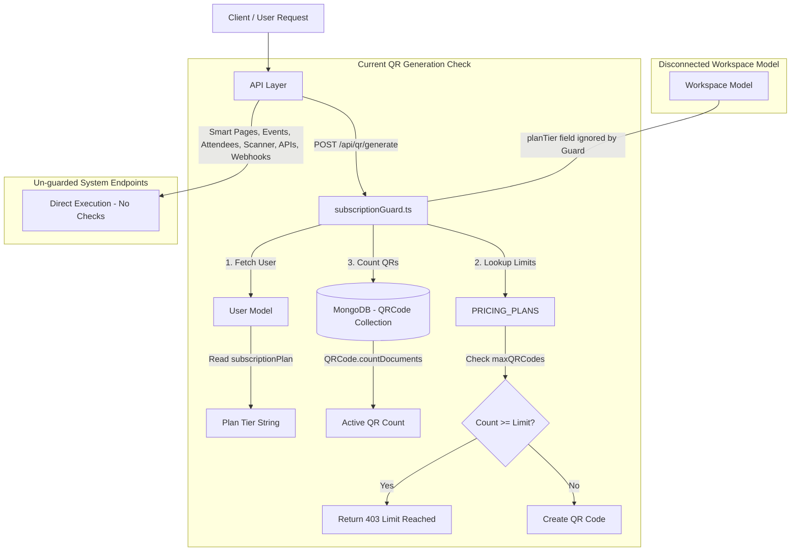
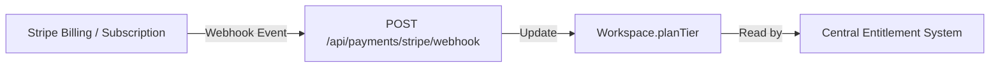

# Current Subscription, Plan, Limit, and Entitlement Audit

**Target File:** `docs/architecture/current-subscription-audit.md`  
**Date:** August 12, 2026  
**Audit Type:** Read-Only Architectural Audit  

---

## Executive Summary

This document presents a comprehensive, read-only architectural audit of the current subscription, plan, limit, and entitlement implementation in the codebase. The objective is to establish an exact baseline of existing capabilities, database schemas, guards, payment integrations, and architectural gaps prior to designing the new centralized Free / Pro / Business entitlement system.

---

## 1. Workspace Plan

### Model Inspection (`models/Workspace.ts`)
The `Workspace` model defines the multi-tenant scope for resources in the system.

```typescript
// models/Workspace.ts (Lines 3-15, 33-37)
export interface IWorkspace extends Document {
    name: string;
    slug: string;
    ownerId: mongoose.Types.ObjectId;
    planTier: "free" | "pro" | "business" | "enterprise";
    settings: {
        defaultLanguage: string;
        timeZone: string;
        customDomain?: string;
    };
    createdAt: Date;
    updatedAt: Date;
}

planTier: {
    type: String,
    enum: ["free", "pro", "business", "enterprise"],
    default: "free",
}
```

### Key Audit Findings:
- **`planTier` Existence:** Yes, `Workspace` contains a `planTier` field.
- **Supported Values:** `"free"`, `"pro"`, `"business"`, `"enterprise"`.
- **Default Value:** `"free"`.
- **Level:** `planTier` is stored at the **Workspace** level on the `Workspace` document. However, `User` ALSO contains a legacy `subscriptionPlan` field (`"free" | "pro" | "business"`).
- **Subscription Details:** `Workspace` model has **NO** subscription fields (e.g., `subscriptionId`, `status`, `currentPeriodEnd`, `stripeCustomerId`, etc.).
- **Creation & Modification Analysis:**
  - `planTier` is initialized during workspace creation in `modules/workspace/service.ts` (`ensureDefaultWorkspace`) and `app/api/v2/workspaces/route.ts` (`POST /api/v2/workspaces`) using:
    ```typescript
    planTier: user.subscriptionPlan || "free"
    ```
  - **CRITICAL DISCREPANCY:** After workspace creation, `Workspace.planTier` is **NEVER** modified anywhere in the codebase. When a user upgrades via payment webhooks or admin updates, only `User.subscriptionPlan` is updated, leaving existing `Workspace.planTier` documents stuck on `"free"`.

---

## 2. Existing Subscription Guard

### Implementation Audit (`lib/guards/subscriptionGuard.ts`)

```typescript
// lib/guards/subscriptionGuard.ts
import dbConnect from "@/config/dbConnect";
import User from "@/models/User";
import QRCode from "@/models/QRCode";
import { PRICING_PLANS, PlanType } from "@/lib/pricing";
import { isValidObjectId } from "mongoose";

export async function subscriptionGuard(userId: string, workspaceId?: string) {
    if (!isValidObjectId(userId)) {
        throw new Error("Invalid User Session. Please logout and login again.");
    }

    await dbConnect();

    const user = await User.findById(userId);
    if (!user) {
        throw new Error("User not found");
    }

    const userPlan = (user.subscriptionPlan as PlanType) || "free";
    const planConfig = PRICING_PLANS[userPlan];

    if (!planConfig) {
        throw new Error("Invalid pricing plan configuration");
    }

    // Prefer workspace-scoped counts; fall back to userId for legacy safety
    const currentQRCount = workspaceId
        ? await QRCode.countDocuments({ workspaceId, isActive: true })
        : await QRCode.countDocuments({ userId, isActive: true });

    if (currentQRCount >= planConfig.maxQRCodes) {
        if (userPlan === "free") {
            throw new Error(
                `Free plan limit reached! You've created ${currentQRCount}/${planConfig.maxQRCodes} QR codes. Upgrade to Pro plan to create more QR codes.`
            );
        }
        throw new Error(
            `You have reached the limit of ${planConfig.maxQRCodes} active QR codes for the ${planConfig.name} plan. Please upgrade to create more.`
        );
    }

    return {
        authorized: true,
        plan: userPlan,
        remaining: planConfig.maxQRCodes - currentQRCount,
    };
}
```

### Detailed Breakdown:
- **Functions:** `subscriptionGuard(userId: string, workspaceId?: string)` is the single guard function in this file.
- **What it checks:** Checks if the number of active QR codes (`isActive: true`) has reached or exceeded `PRICING_PLANS[userPlan].maxQRCodes`.
- **Resource Limited:** **ONLY QR Codes.** No other resource (Smart Pages, Events, Attendees, API keys, Webhooks, Notifications, Scanner devices) is guarded.
- **Limit Source:** Reads `PRICING_PLANS[userPlan]`, where `userPlan` is fetched from `User.subscriptionPlan` (ignoring `Workspace.planTier`).
- **Workspace vs User Determination:**
  - Fetches plan from `User.subscriptionPlan`.
  - Counts active QRs using `workspaceId` if provided: `QRCode.countDocuments({ workspaceId, isActive: true })`.
  - Falls back to `userId` count if `workspaceId` is missing.
- **Caller Tracing:**
  - **Caller 1:** `app/api/qr/generate/route.ts` (Line 49)
    - Triggers during `POST /api/qr/generate`.
    - Catch block behavior: Catches error thrown by guard and returns a `403 Forbidden` response with body:
      ```json
      {
        "success": false,
        "message": "Free plan limit reached! You've created 3/3 QR codes...",
        "upgradeRequired": true,
        "currentPlan": "free"
      }
      ```
  - **Caller 2:** `components/create/CreateQRForm.tsx` (Client component)
    - Handles the `403` status and `upgradeRequired: true` response by displaying an upgrade modal/alert to the user.
- **Other API Traces:** No other API route or service invokes `subscriptionGuard`.

---

## 3. Existing Plan Logic

### Codebase Inventory Table

| File | Logic / Component | Resource Managed | Current Behavior |
| :--- | :--- | :--- | :--- |
| `lib/pricing.ts` | Static configuration map (`PRICING_PLANS`) | Static metadata & QR limits | Defines `free` (max 3 QRs), `pro` (max 5 QRs), `business` (max 1,000,000 QRs) & UI display strings. |
| `lib/guards/subscriptionGuard.ts` | Server guard function | QR Codes | Reads `User.subscriptionPlan`, queries `QRCode.countDocuments`, throws error if count $\ge$ `maxQRCodes`. |
| `models/Workspace.ts` | Schema definition | Workspace state | Defines `planTier` enum (`free`, `pro`, `business`, `enterprise`). Default `free`. |
| `models/User.ts` | Schema definition | User state | Defines `subscriptionPlan` enum (`free`, `pro`, `business`). Default `free`. |
| `models/Subscription.ts` | Schema definition | Payment history | Stores transaction logs (amount, provider, status, startDate, endDate). |
| `modules/workspace/service.ts` | Service (`ensureDefaultWorkspace`, `listUserWorkspaces`) | Workspace initialization | Copies `user.subscriptionPlan` to `workspace.planTier` when workspace is created. |
| `app/api/v2/workspaces/route.ts` | API route (`POST /api/v2/workspaces`) | Workspace creation | Sets `planTier = user.subscriptionPlan \|\| "free"` on newly created workspace. |
| `app/api/qr/generate/route.ts` | API route (`POST /api/qr/generate`) | QR Generation | Calls `subscriptionGuard(userId, workspaceId)`. Returns `403` if limit reached. |
| `app/api/payments/razorpay/create-order/route.ts` | Payment API | Razorpay Order | Looks up `PRICING_PLANS[plan].price`, creates Razorpay order in INR paise. |
| `app/api/payments/razorpay/webhook/route.ts` | Webhook API | Plan Upgrade | Verifies HMAC, creates `Subscription`, updates `User.subscriptionPlan`. **Does NOT update Workspace.planTier.** |
| `app/api/payments/stripe/checkout/route.ts` | Payment API | Stripe Session | Creates Stripe Checkout Session. **No webhook exists to handle completion.** |
| `app/api/admin/users/route.ts` | Admin API (`PATCH /api/admin/users`) | User Management | Admin updates `User.subscriptionPlan`. **Does NOT update Workspace.planTier.** |
| `modules/api-key/constants.ts` & `service.ts` | Rate Limiter | API Key Requests | Enforces soft rate limit per API key environment (TEST: 60 rpm, LIVE: 300 rpm). **Not tied to plan.** |
| `components/billing/PricingContent.tsx` | UI Component | Billing Page | Renders plan pricing cards and triggers Razorpay or Stripe checkout flow. |

---

## 4. Current Resource Limits Audit

Below is the resource-by-resource audit determining whether limits currently exist in code:

| Resource | Is Limit Enforced? | Where Enforced? | Current Limit Value | Scope | Type |
| :--- | :--- | :--- | :--- | :--- | :--- |
| **QR Codes** | **Yes** | `lib/guards/subscriptionGuard.ts` | Free: 3, Pro: 5, Business: 1,000,000 | Workspace count checked against User plan | Hard-coded in `lib/pricing.ts` |
| **Smart Pages / Review Pages** | **No** | None | Unlimited | N/A | Unenforced |
| **Events** | **No** | None | Unlimited | N/A | Unenforced |
| **Attendees** | **No** | None | Unlimited | N/A | Unenforced |
| **Scanner Devices** | **No** | None | Unlimited | N/A | Unenforced |
| **API Keys** | **Partial** (Rate limit only) | `modules/api-key/service.ts` | No count limit. Rate limit: 60 req/min (TEST), 300 req/min (LIVE) | API key level | Hard-coded in `modules/api-key/constants.ts` |
| **Webhooks** | **No** | None | Unlimited | N/A | Unenforced |
| **Notifications** | **No** | None | Unlimited | N/A | Unenforced |
| **Developer APIs** | **No** | None | Unlimited access | N/A | Unenforced |
| **Analytics** | **No** | None | Unlimited access | N/A | Unenforced |
| **Workspaces** | **No** | None | Unlimited workspace creation | N/A | Unenforced |

---

## 5. Feature Gating Audit

We audited whether any platform features are restricted based on the current workspace/user plan:

- **API Access:** Description in `PRICING_PLANS.business` lists "API Access", but `POST /api/v2/developer/api-keys` contains **zero** plan checks. Free users can create live API keys.
- **Webhooks:** `POST /api/v2/developer/webhooks` contains **zero** plan checks. Free users can create unlimited webhook endpoints.
- **Notifications:** `POST /api/v2/developer/notifications` contains **zero** plan checks. Free users can configure custom notification templates.
- **Advanced Analytics:** `PRICING_PLANS` defines `analytics: "basic" | "full" | "advanced"`, but analytics endpoints (`/api/v2/analytics`, `/api/v2/events/[eventId]/analytics`) return full telemetry for all users regardless of plan.
- **Custom Branding / Logo / Colors:** `PRICING_PLANS.pro` lists "Custom Logo & Colors", but `POST /api/qr/generate` accepts and processes `logoUrl`, `foregroundColor`, and `backgroundColor` for Free tier users without restriction.
- **Scanner Features:** `POST /api/v2/scanner/pair` and staff sessions have no plan restrictions.

---

## 6. Usage Calculation Audit

Currently, usage calculation is performed exclusively for **QR Codes**:

```typescript
// Usage query in lib/guards/subscriptionGuard.ts
const currentQRCount = workspaceId
    ? await QRCode.countDocuments({ workspaceId, isActive: true })
    : await QRCode.countDocuments({ userId, isActive: true });
```

### Database Query Analysis & Performance Concerns:
- **Mongo Query:** `QRCode.countDocuments({ workspaceId, isActive: true })`
- **Filter Used:** `{ workspaceId: ObjectId(...), isActive: true }`
- **Indexes in `models/QRCode.ts`:**
  - Single index on `userId`: `{ userId: 1 }`
  - Single index on `workspaceId`: `{ workspaceId: 1 }`
  - Single index on `shortUrl`: `{ shortUrl: 1, unique: true }`
- **Performance Risk:**
  - There is **NO compound index** on `{ workspaceId: 1, isActive: 1 }`.
  - On collections with many inactive or historic QR codes, MongoDB must fetch index keys and inspect documents to evaluate `isActive: true`.
  - Every single QR creation request executes an un-cached count query against MongoDB.

---

## 7. API Behavior Summary

Only **one single API endpoint** in the entire system enforces subscription limits:

| Method | Route | Resource | Guard Used | Limit Checked | Error Returned |
| :--- | :--- | :--- | :--- | :--- | :--- |
| `POST` | `/api/qr/generate` | QRCode | `subscriptionGuard(userId, workspaceId)` | `PRICING_PLANS[user.subscriptionPlan].maxQRCodes` | Status `403 Forbidden`<br>`{ success: false, message: "...", upgradeRequired: boolean, currentPlan: string }` |

All other endpoints across `smartpages`, `events`, `attendees`, `scanner`, `api-keys`, `webhooks`, and `notifications` operate **without entitlement checks**.

---

## 8. Admin / Plan Management Audit

We inspected admin routes (`app/api/admin/*`) and administrative pages (`app/admin/*`):

- **User Plan Modification:**
  - Route `PATCH /api/admin/users` accepts `{ userId, role, subscriptionPlan }` and updates `User.subscriptionPlan`.
  - Admin UI at `app/admin/users/page.tsx` allows updating a user's plan.
- **Workspace Plan Modification:**
  - **MISSING:** There is **no API route or admin UI** to update `Workspace.planTier`.
- **Subscription Overrides / Limits:**
  - **MISSING:** Administrators cannot grant custom limits, extend trial periods, or set per-workspace quotas.
- **Architectural Mismatch:** Because admin updates affect only `User.subscriptionPlan`, any workspace created before the admin update retains its initial `planTier`.

---

## 9. Payment / Billing Implementation

### Existing Razorpay Functionality
- **Order Creation:** `POST /api/payments/razorpay/create-order` validates input using `checkoutPlanSchema`, reads `PRICING_PLANS[plan].price`, and creates a Razorpay order in INR paise.
- **Webhook Handler:** `POST /api/payments/razorpay/webhook` receives Razorpay webhooks, verifies HMAC `x-razorpay-signature`, and handles `payment.captured`:
  ```typescript
  // 1. Creates Subscription document (valid 30 days)
  await Subscription.create({
      userId, plan, amount, currency: payment.currency,
      paymentProvider: "razorpay", providerOrderId: payment.order_id,
      providerPaymentId: payment.id, status: "active", startDate, endDate
  });
  // 2. Updates User Plan ONLY
  await User.findByIdAndUpdate(userId, { subscriptionPlan: plan });
  ```

### Existing Stripe Functionality
- **Checkout Session:** `POST /api/payments/stripe/checkout` creates a Stripe Checkout Session in `mode: "payment"`.
- **Webhook Handler:** **MISSING.** There is no webhook endpoint under `/api/payments/stripe` to handle `checkout.session.completed` or update database state.

### Clear Separation: Existing Payment vs. Missing Subscription Billing

```
[ EXISTING PAYMENT CODE ]                     [ MISSING SUBSCRIPTION BILLING ]
- One-time order creation (Razorpay & Stripe)   - Workspace.planTier synchronization
- Razorpay payment capture webhook              - Stripe webhook handler
- User.subscriptionPlan update                  - Recurring subscription lifecycle (renewals, cancels)
- Transaction log in Subscription model         - Workspace-scoped subscription billing state
                                                - Grace periods, trial states, invoice handling
```

---

## 10. Database / Data Model Inspection

Summary of plan, limit, usage, and multi-tenancy fields across all core models:

```
┌──────────────────────────────────────┐       ┌──────────────────────────────────────┐
│                User                  │       │              Workspace               │
├──────────────────────────────────────┤       ├──────────────────────────────────────┤
│ _id: ObjectId                        │       │ _id: ObjectId                        │
│ email: String                        │       │ ownerId: ObjectId (ref User)         │
│ subscriptionPlan: "free"|"pro"|"bus" │       │ planTier: "free"|"pro"|"bus"|"ent"   │
│ defaultWorkspaceId: ObjectId         │       └──────────────────────────────────────┘
└──────────────────────────────────────┘                          │ 1
                   │ 1                                            │
                   │                                              │ *
                   ▼ *                                            ▼
┌──────────────────────────────────────┐       ┌──────────────────────────────────────┐
│             Subscription             │       │            Domain Models             │
├──────────────────────────────────────┤       ├──────────────────────────────────────┤
│ userId: ObjectId (ref User)          │       │ QRCode (workspaceId, isActive, ...)  │
│ plan: "free"|"pro"|"business"        │       │ SmartPage (workspaceId, ...)         │
│ paymentProvider: "razorpay"|"stripe" │       │ Event (workspaceId, ...)             │
│ status: "active"|"pending"|...       │       │ Attendee (workspaceId, eventId, ...) │
│ startDate: Date, endDate: Date       │       │ ApiKey (workspaceId, ...)            │
└──────────────────────────────────────┘       │ WebhookEndpoint (workspaceId, ...)   │
                                               │ ScannerDevice (workspaceId, ...)     │
                                               └──────────────────────────────────────┘
```

- **`Workspace`:** Contains `planTier`. Missing subscription reference or lifecycle dates.
- **`User`:** Contains `subscriptionPlan`. Used by current `subscriptionGuard`.
- **`Subscription`:** Stores payment records tied to `userId`. Missing `workspaceId`.
- **Domain Models (`QRCode`, `SmartPage`, `Event`, `Attendee`, `ScannerDevice`, `ApiKey`, `WebhookEndpoint`, `NotificationTemplate`):** All contain `workspaceId`. None contain entitlement or quota overrides.

---

## 11. Current Architecture Diagram



---

## 12. Problems & Gaps Identified

1. **Dual Source of Truth (User vs. Workspace):**
   - Multi-tenant features use `Workspace`, but `subscriptionGuard` checks `User.subscriptionPlan`.
   - When a user upgrades, `User.subscriptionPlan` changes, but existing workspaces remain on `Workspace.planTier = "free"`.
2. **Hard-coded Limits & Inconsistencies:**
   - In `lib/pricing.ts`, `pro` tier has `maxQRCodes: 5` (which is unusually low and restrictive compared to expected SaaS tiers). `business` is set to `1,000,000`.
3. **Zero Feature Gating:**
   - API keys, webhooks, notification templates, custom branding, and advanced analytics have no backend plan checks. Any free user can consume advanced features.
4. **Single-Resource Guarding:**
   - Only QR codes are limited. There are no limit checks for Smart Pages, Events, Attendees per event, Scanner devices, or Webhooks.
5. **Incomplete Stripe Integration:**
   - Stripe checkout route exists, but has no webhook handler to complete transactions or update plans.
6. **Missing Compound Database Indexing:**
   - `QRCode` collection lacks an index on `{ workspaceId: 1, isActive: 1 }`, leading to unindexed count scans.
7. **No Admin Testing / Override Mechanism:**
   - Administrators cannot override plan limits for specific workspaces or test plan tiers without modifying DB records directly.
8. **UI vs. Server Mismatch:**
   - Landing/Pricing UI advertises feature restrictions that the API layer does not enforce.

---

## 13. Recommended Target Architecture

The recommended evolution transitions the codebase from user-level, single-resource checking to a centralized, workspace-scoped entitlement architecture.

```mermaid
flowchart TD
    Req[Client / API Request] --> Res[resolveWorkspace Context]
    Res --> Ent[Centralized Entitlement Service]
    
    subgraph "Target Entitlement Engine"
        Ent --> Engine[Entitlement Engine]
        Engine --> Config[Central Plan Configuration\n(plans.config.ts)]
        Engine --> WSDoc[Workspace.planTier]
        Engine --> Meter[Usage Metering Service]
        Meter --> DB[(MongoDB Queries / Redis Cache)]
    end
    
    Engine --> Check{Check Feature / Limit}
    Check -->|Allowed| Action[Proceed to Controller Service]
    Check -->|Denied| Forbidden[Return 403 Plan Limit Exceeded]
```

### Proposed Component Mapping:
- **Reuse & Retain:**
  - `models/Workspace.ts`: Keep `planTier` as the single source of truth for workspace limits.
  - `core/workspace/resolveWorkspace.ts`: Use as context injector for `workspaceId` and `planTier`.
- **Refactor / Replace:**
  - Replace `lib/guards/subscriptionGuard.ts` with a centralized `EntitlementService`.
  - Replace `lib/pricing.ts` with a comprehensive `config/plans.ts` defining limits for all resources (QRs, Events, Attendees, API Keys, Webhooks) and feature flags.
  - Update payment webhooks (`Razorpay` & new `Stripe`) to update `Workspace.planTier`.

---

## 14. Stripe Boundary & Future Integration Plan

To keep current milestones focused, Stripe payment implementation remains strictly outside this audit. The future architecture cleanly supports Stripe as follows:



1. **Decoupled Design:** The entitlement system checks `Workspace.planTier` and does not care whether the tier was assigned by Razorpay, Stripe, manual admin grant, or promotional code.
2. **Future Stripe Webhook:** When Stripe is introduced, its webhook will simply receive `customer.subscription.created/updated/deleted` events, map the customer to a `workspaceId`, and update `Workspace.planTier`.

---

## 15. Final Summary

### Status Matrix

| Category | Status | Details |
| :--- | :--- | :--- |
| **CURRENTLY IMPLEMENTED** | **Basic QR Guard & Razorpay Webhook** | `subscriptionGuard` for active QR limit; Razorpay payment capture updating `User.subscriptionPlan`. |
| **PARTIALLY IMPLEMENTED** | **Workspace Model & Stripe Checkout** | `Workspace.planTier` field exists but is un-synced; Stripe checkout route exists without webhook. |
| **MISSING** | **Entitlement Engine & Feature Gating** | Central plan config, workspace sync on upgrade, resource limits for Events/Pages/APIs/Webhooks, Stripe webhook. |

### Recommended Next Step:
Proceed to design the centralized **Workspace Entitlement System** (PRD & System Blueprint) defining unified limits for Free, Pro, and Business tiers across all workspace resources.

### Migration Roadmap:
1. **Phase 1 (Config & Service):** Create central `plans.config.ts` and `EntitlementService`.
2. **Phase 2 (Workspace Sync):** Add helper to sync `User.subscriptionPlan` upgrades to `Workspace.planTier`.
3. **Phase 3 (Guard Migration):** Replace `subscriptionGuard` calls in QR generation with `EntitlementService.assertLimit(workspaceId, "qr_codes")`.
4. **Phase 4 (Feature Gating):** Add entitlement assertions to Smart Pages, Events, Attendees, API keys, and Webhooks.
