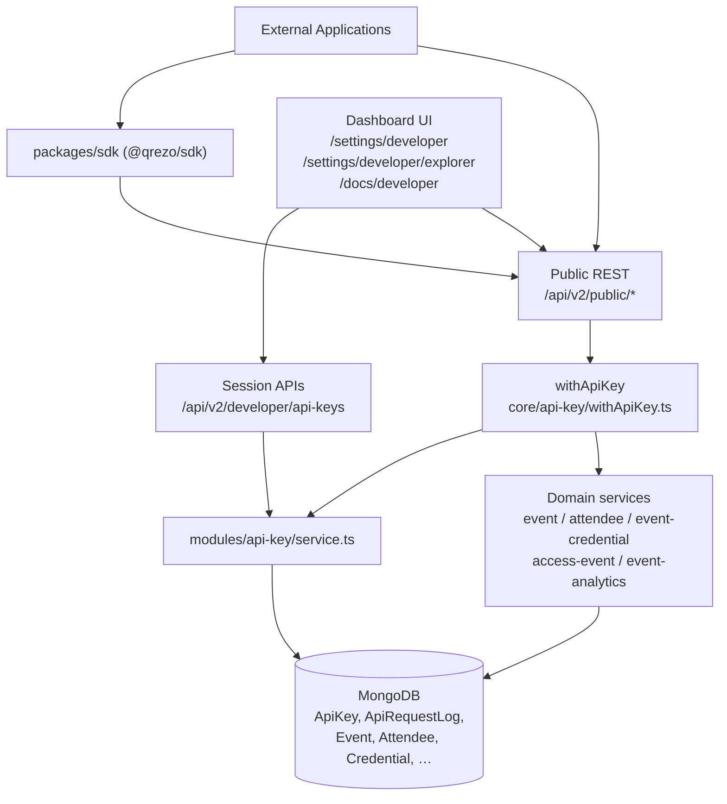
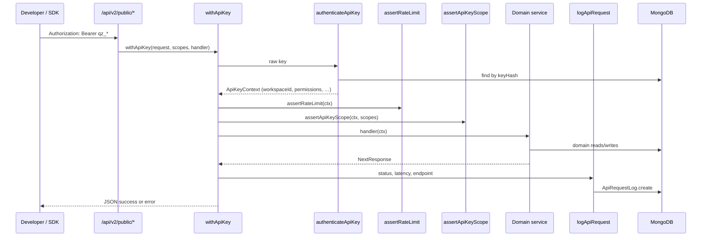
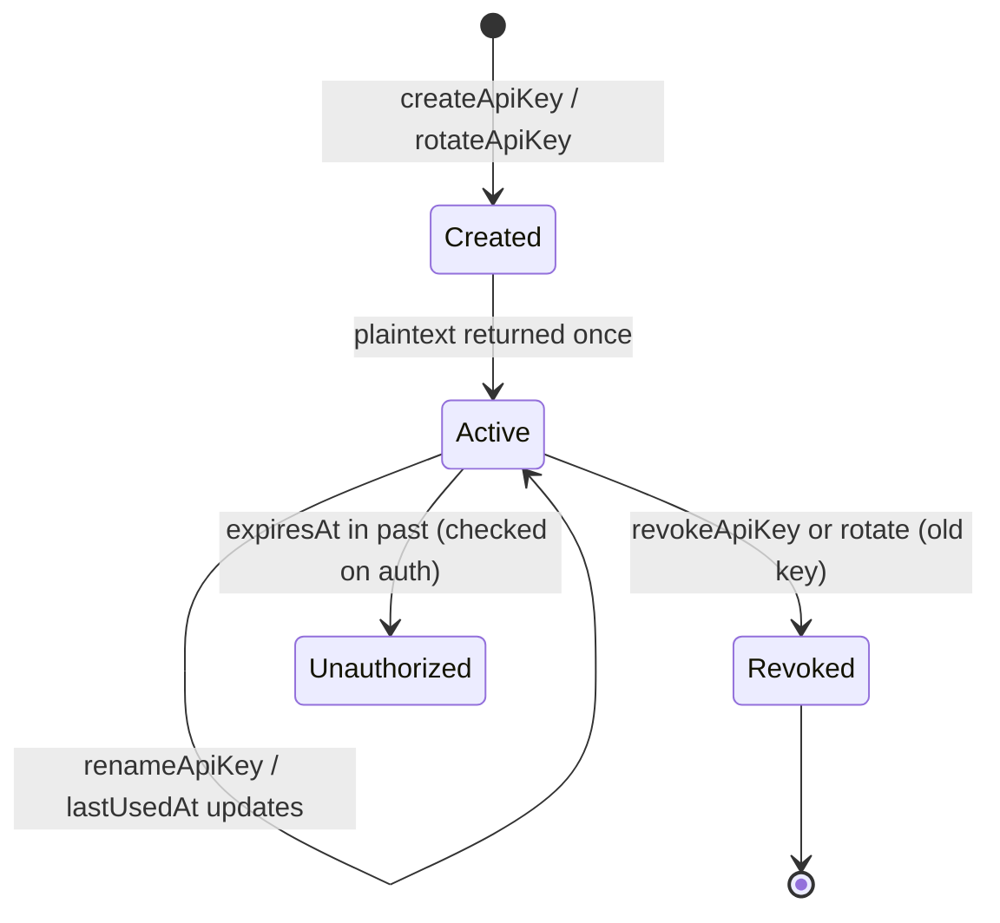
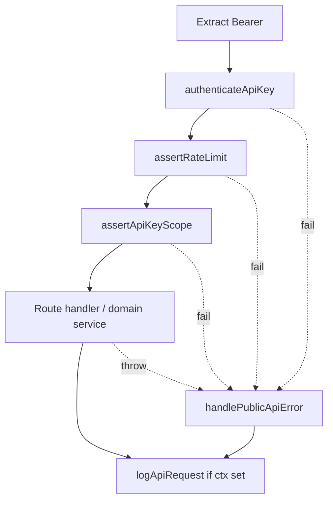
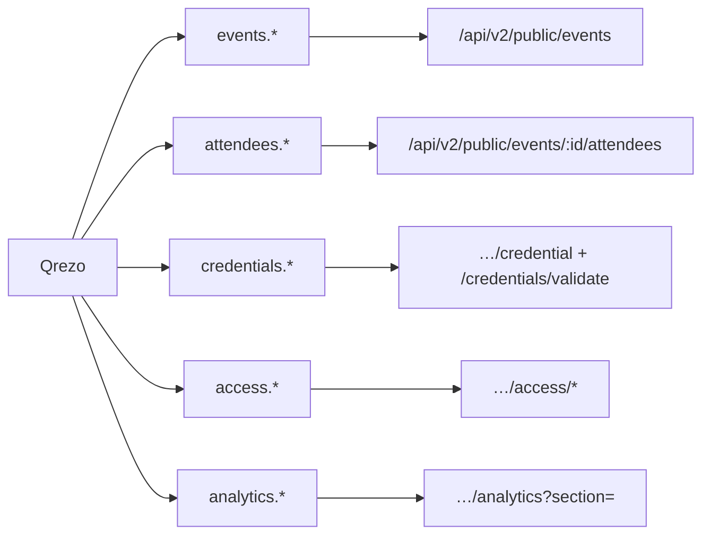
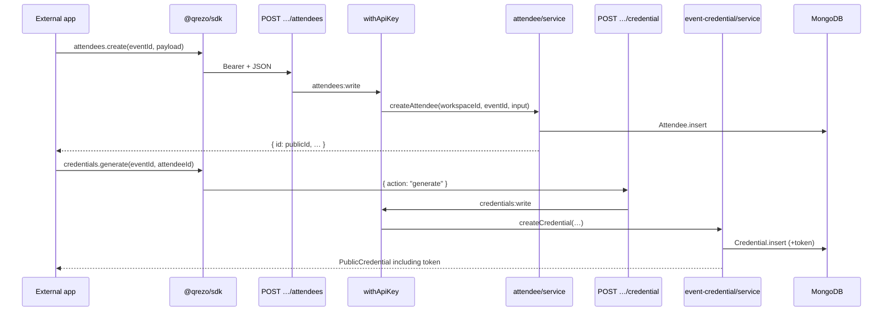

# Qrezo Events Developer Platform Architecture

| Field | Value |
| --- | --- |
| **Last Updated** | 2026-07-26 |
| **Version** | 1.0 (Milestone 7 — as implemented) |
| **Purpose** | Describe how the Developer Platform currently works in this codebase so engineers can operate, extend, and integrate against it without guessing. |
| **Audience** | Backend developers, contributors, and API integrators joining or using Qrezo Events |

---

## 1. Overview

### Why the Developer Platform exists

The Developer Platform lets external applications register attendees, issue credentials, validate access, and read analytics **without** using dashboard session cookies. Qrezo remains the system of record for events, attendees, credentials, and access; third-party apps call a versioned public REST API authenticated with workspace-scoped API keys.

### How external developers integrate

1. A workspace owner/admin opens **Settings → Developer** and creates an API key (`qz_test_…` or `qz_live_…`).
2. The full secret is shown once in the dashboard (and again only on rotate).
3. Integrations call `/api/v2/public/*` with `Authorization: Bearer <API_KEY>`, or use the TypeScript SDK (`@qrezo/sdk` in `packages/sdk`).
4. Dashboard session auth is never used for public API calls. Next.js `middleware.ts` does not match `/api/*`; public routes rely solely on `withApiKey`.

### High-level architecture



### Relationship between Dashboard, Public API, SDK, and Service Layer

| Layer | Role in current code |
| --- | --- |
| **Dashboard** | Manages keys/logs via session (`resolveWorkspace` + `assertCanManageEvents`). Hosts Explorer and in-app docs. |
| **Developer APIs** | `/api/v2/developer/api-keys*` — NextAuth/workspace session, not Bearer keys. |
| **Public REST** | Thin App Router handlers under `app/api/v2/public/` that call `withApiKey` then existing domain services. |
| **SDK** | Thin HTTP client that maps methods to public routes; no business logic. |
| **Service layer** | Shared modules (`modules/event`, `modules/attendee`, etc.) used by both dashboard APIs and public APIs. |

---

## 2. Developer Platform Components

### 2.1 API Keys

| | |
| --- | --- |
| **Purpose** | Authenticate and authorize external callers to a single workspace. |
| **Responsibilities** | Create, list, rename/update, revoke, rotate; hash secrets; expose prefix + metadata only after creation. |
| **Folder location** | `modules/api-key/`, `models/ApiKey.ts` |
| **Key services** | `createApiKey`, `listApiKeys`, `renameApiKey`, `revokeApiKey`, `rotateApiKey`, `authenticateApiKey`, `assertApiKeyScope` in `modules/api-key/service.ts` |
| **Dependencies** | MongoDB `ApiKey`, helpers in `modules/api-key/helpers.ts`, Zod schemas in `modules/api-key/validation.ts` |

### 2.2 Public REST API

| | |
| --- | --- |
| **Purpose** | Versioned HTTP surface for events, attendees, credentials, access, analytics. |
| **Responsibilities** | Parse requests, enforce scopes via `withApiKey`, call domain services, return `{ success, data }` or `{ success, error }`. |
| **Folder location** | `app/api/v2/public/` |
| **Key services** | Domain modules listed per route (see §5). |
| **Dependencies** | `core/api-key/withApiKey.ts`, `core/errors/handlePublicApiError.ts`, Zod module validators |

### 2.3 Authentication Middleware (`withApiKey`)

| | |
| --- | --- |
| **Purpose** | Single entry wrapper for every public route handler. |
| **Responsibilities** | Extract Bearer token → authenticate → rate-limit → check scopes → run handler → log request. |
| **Folder location** | `core/api-key/withApiKey.ts` |
| **Key services** | `authenticateApiKey`, `assertRateLimit`, `assertApiKeyScope`, `logApiRequest` |
| **Dependencies** | `modules/api-key/service.ts`, `handlePublicApiError` |

### 2.4 Rate Limiting

| | |
| --- | --- |
| **Purpose** | Soft per-key request caps by environment. |
| **Responsibilities** | In-process fixed window counters; throw `AppRateLimitError` → HTTP 429 + `Retry-After: 60`. |
| **Folder location** | `assertRateLimit` / `AppRateLimitError` in `modules/api-key/service.ts`; limits in `modules/api-key/constants.ts` |
| **Key services** | `assertRateLimit` |
| **Dependencies** | Process-local `Map` (not Redis/DB) |

### 2.5 Request Logging

| | |
| --- | --- |
| **Purpose** | Persist recent public API traffic for the workspace developer UI. |
| **Responsibilities** | Write `ApiRequestLog` after authenticated requests (success or failure after auth). |
| **Folder location** | `models/ApiRequestLog.ts`, `logApiRequest` / `listApiRequestLogs` in `modules/api-key/service.ts` |
| **Key services** | `logApiRequest`, `listApiRequestLogs` |
| **Dependencies** | MongoDB; dashboard fetch via `GET /api/v2/developer/api-keys?logs=1` |

### 2.6 Developer Dashboard

| | |
| --- | --- |
| **Purpose** | UI to manage keys and view recent requests. |
| **Responsibilities** | Create key (one-time copy), rename, rotate, revoke; show environment, permissions, last used, expiry; link to Explorer/docs. |
| **Folder location** | `app/(dashboard)/settings/developer/page.tsx`; entry link from `app/(dashboard)/settings/page.tsx` |
| **Key services** | Consumes `/api/v2/developer/api-keys*` |
| **Dependencies** | NextAuth session; `API_KEY_SCOPE_VALUES` / `DEFAULT_API_KEY_SCOPES` |

### 2.7 API Explorer

| | |
| --- | --- |
| **Purpose** | Lightweight in-dashboard request runner. |
| **Responsibilities** | Paste API key, pick preset endpoint, fill IDs/body, execute `fetch`, show JSON + cURL. |
| **Folder location** | `app/(dashboard)/settings/developer/explorer/page.tsx` |
| **Key services** | None server-side; calls public routes from the browser with Bearer header. |
| **Dependencies** | Same-origin `/api/v2/public/*` |

### 2.8 Documentation (in-app)

| | |
| --- | --- |
| **Purpose** | Onboarding copy for Getting Started, auth, REST, SDK, errors, rate limits, pagination. |
| **Responsibilities** | Static client page with sections and copy-paste examples. |
| **Folder location** | `app/(dashboard)/docs/developer/page.tsx` (route `/docs/developer`) |
| **Key services** | None |
| **Dependencies** | Dashboard layout; NextAuth middleware matcher includes `/docs/:path*` |

### 2.9 TypeScript SDK

| | |
| --- | --- |
| **Purpose** | Promise-based typed client for Node.js / Next.js / React (any runtime with `fetch`). |
| **Responsibilities** | Attach Bearer header; unwrap `{ success, data }`; throw typed errors. |
| **Folder location** | `packages/sdk/` |
| **Key services** | `Qrezo` client + resource classes under `packages/sdk/src/resources/` |
| **Dependencies** | Public REST only (no direct DB) |

---

## 3. API Authentication Flow

### Lifecycle (public request)

1. Client sends `Authorization: Bearer qz_test_…` or `qz_live_…`.
2. `withApiKey` extracts the Bearer value (`extractBearer`).
3. `authenticateApiKey`:
   - Parses environment from key prefix (`qz_test_` / `qz_live_`).
   - Hashes raw key with pepper (`hashApiKey`).
   - Loads `ApiKey` by `keyHash` (with `+keyHash`).
   - Rejects revoked, expired, or environment-mismatch keys.
   - Fire-and-forget updates `lastUsedAt`.
   - Returns `ApiKeyContext` including `workspaceId` and `createdByUserId` from the key document.
4. `assertRateLimit(ctx)`.
5. `assertApiKeyScope(ctx, requiredScopes)` for the route.
6. Handler runs with `ctx.workspaceId` (workspace isolation) and often `ctx.createdByUserId` (e.g. event create, access actor).
7. Response returned; if `ctx` was established, `logApiRequest` runs asynchronously.

Dashboard key management uses **session** auth (`resolveWorkspace`), not Bearer keys.



---

## 4. API Key Lifecycle



### Creation

- Dashboard/API: `POST /api/v2/developer/api-keys` → `createApiKey`.
- Generates `publicId` (`apk_…`), raw key `qz_{test|live}_{base64url}`, `keyPrefix` = first 12 characters, `keyHash` = SHA-256 of `rawKey:pepper`.
- Persists metadata; returns `CreatedApiKey` including `apiKey` plaintext **once**.

### Storage

| Stored | Not stored |
| --- | --- |
| `keyHash` (`select: false`), `keyPrefix`, permissions, environment, workspace, createdBy, expiresAt, revokedAt, lastUsedAt | Full plaintext key |

Pepper resolution (`modules/api-key/helpers.ts`): `API_KEY_PEPPER` → else `NEXTAUTH_SECRET` → else `"qrezo-api-key-dev"`.

### Display

- After create/rotate: dashboard amber banner with Copy.
- List views show `keyPrefix…` only (`toPublic` never includes hash or full key).

### Rotation

- `POST /api/v2/developer/api-keys/[keyId]/rotate` → `rotateApiKey`.
- Sets `revokedAt` on the old document, then `createApiKey` with same name, description, environment, permissions, expiresAt.
- Returns a **new** key document + new plaintext.

### Revocation

- `DELETE /api/v2/developer/api-keys/[keyId]` → sets `revokedAt`.
- Auth thereafter: `UnauthorizedError("API key has been revoked")`.
- Revoked keys cannot be renamed (`BadRequestError`).

### Expiration

- Optional `expiresAt` on create/update schemas.
- Checked in `authenticateApiKey`; expired keys fail with unauthorized.
- UI shows expiry or “No expiry”.

### Last used

- On successful auth lookup, non-blocking `ApiKey.updateOne({ lastUsedAt: now })`.

### Security considerations (as implemented)

- Hash + prefix only at rest; `keyHash` excluded from default selects.
- Workspace scoping on management APIs via `workspaceId` from session.
- Public traffic scoped by key’s `workspaceId`.
- Full key never returned from list/get.

---

## 5. Public API Architecture

### Versioning

All public integrator routes live under **`/api/v2/public`**. Dashboard domain APIs also use `/api/v2/…` but are session-authenticated and are not part of the public developer surface.

### Folder structure (App Router handlers)

There are no separate “controller” classes; each `route.ts` is the HTTP adapter.

```
app/api/v2/public/
  credentials/validate/route.ts
  events/route.ts
  events/[eventId]/route.ts
  events/[eventId]/attendees/route.ts
  events/[eventId]/attendees/[publicId]/route.ts
  events/[eventId]/attendees/[publicId]/credential/route.ts
  events/[eventId]/access/validate/route.ts
  events/[eventId]/access/entry/route.ts
  events/[eventId]/access/exit/route.ts
  events/[eventId]/analytics/route.ts
```

### Route → scope → service map

| Method | Path | Scope | Service module |
| --- | --- | --- | --- |
| GET | `/events` | `events:read` | `modules/event/service` `listEvents` |
| POST | `/events` | `events:write` | `createEvent` |
| GET/PATCH/DELETE | `/events/:eventId` | read / write / write | `getEventForWorkspace`, `updateEvent`, `deleteEvent` |
| GET/POST | `/events/:eventId/attendees` | attendees:read / write | `listAttendees`, `createAttendee` |
| GET/PATCH/DELETE | `/events/:eventId/attendees/:publicId` | read / write / write | `getAttendee`, `updateAttendee`, `deleteAttendee` |
| GET/POST | `…/attendees/:publicId/credential` | credentials:read / write | `getCredential`, `createCredential` / regenerate / revoke / restore |
| POST | `/credentials/validate` | `credentials:read` | `validateCredential` |
| POST | `…/access/validate` | `access:validate` | `validateAccess` |
| POST | `…/access/entry` | `access:validate` | `createManualEntry` |
| POST | `…/access/exit` | `access:validate` | `createManualExit` |
| GET | `…/analytics?section=` | `analytics:read` | `getEventAnalyticsOverview`, `getAttendanceAnalytics`, `getAccessAnalytics`, `getCredentialAnalytics` |

### Middleware

Every public handler wraps logic in `withApiKey(request, scope, handler)`.

### Validation

- Zod schemas from domain modules (`createEventSchema`, `createAttendeeSchema`, `listAttendeesQuerySchema`, local `z.object` for access/credential actions).
- Failures become `validation_error` via `handlePublicApiError`.

### Response format

Success (`publicOk`):

```json
{ "success": true, "data": { } }
```

Error (`handlePublicApiError`):

```json
{
  "success": false,
  "error": {
    "code": "permission_denied",
    "message": "API key does not have attendees:write scope."
  }
}
```

Events are shaped by `publicEvent` in `modules/api-key/publicSerializers.ts` (`id` = Mongo `_id` string). Attendees use `toPublicAttendee` (`id` = attendee `publicId`).

### Shared service layer

Public handlers import the **same** services as dashboard event/attendee/credential/access/analytics APIs. They do not reimplement business rules. Example: creating an attendee via public API defaults `registrationSource` to `API` when omitted (`app/api/v2/public/events/[eventId]/attendees/route.ts`).

### Developer management routes (session)

```
app/api/v2/developer/api-keys/route.ts          GET list | ?logs=1, POST create
app/api/v2/developer/api-keys/[keyId]/route.ts  PATCH update, DELETE revoke
app/api/v2/developer/api-keys/[keyId]/rotate/route.ts  POST rotate
```

These use `handleApiError` (dashboard error shape), not `handlePublicApiError`.

---

## 6. Middleware Pipeline

Implemented as a **single function** `withApiKey`, not a chain of Next.js middleware files. Order of operations:



| Step | Responsibility |
| --- | --- |
| **Bearer extract** | Require `Authorization: Bearer …`; else `UnauthorizedError`. |
| **Authenticate** | Format, hash lookup, revoke/expiry/env checks; build `ApiKeyContext` (**workspace resolution** = key’s `workspaceId`). |
| **Rate limit** | Per-key in-memory counter vs `RATE_LIMIT_PER_MINUTE`. |
| **Scope validation** | Ensure all required scopes are on the key. |
| **Handler** | Route-specific Zod + domain call. |
| **Logger** | Records method, path+query, status, latency, optional error code; skipped if auth never produced `ctx`. |

Root `middleware.ts` (NextAuth) protects dashboard pages only; it does **not** run on `/api/v2/public/*`.

---

## 7. SDK Architecture

### Package

- Name: `@qrezo/sdk` (`packages/sdk/package.json`, version `0.1.0`)
- Build: `tsc` → CommonJS under `packages/sdk/dist/`
- Root scripts: `npm run build:sdk`, `npm run typecheck:sdk`
- Not wired as an npm workspace of the main app; installable via path/`npm install ./packages/sdk`

### Folder structure

```
packages/sdk/
  package.json
  tsconfig.json
  README.md
  src/
    index.ts          # public exports
    client.ts         # Qrezo
    http.ts           # HttpClient
    errors.ts         # QrezoError hierarchy
    types.ts
    resources/
      events.ts
      attendees.ts
      credentials.ts
      access.ts
      analytics.ts
```

### Client and resources

```ts
const client = new Qrezo({
  apiKey: process.env.QREZO_API_KEY!,
  baseUrl: "https://your-host", // optional; empty = relative paths
});
// client.events | attendees | credentials | access | analytics
```

### Request pipeline

1. `HttpClient.request` builds URL = `baseUrl + path`.
2. Sets `Authorization: Bearer`, `Accept: application/json`, JSON body when present.
3. Parses JSON; on failure or `success === false`, maps to typed errors.
4. Returns `data` only.

### Typed responses and errors

- Success types for events/attendees inputs/outputs in `types.ts`; credentials/access/analytics often typed as `unknown`.
- Errors: `QrezoError`, `QrezoAuthError`, `QrezoPermissionError`, `QrezoRateLimitError`, `QrezoNotFoundError`, `QrezoValidationError`.

### SDK → REST mapping



| SDK method | HTTP |
| --- | --- |
| `events.list/get/create/update/delete` | GET/GET/POST/PATCH/DELETE `/api/v2/public/events[…]` |
| `attendees.list/get/create/update/delete` | CRUD under `/events/:eventId/attendees` |
| `credentials.generate/regenerate/revoke/restore` | POST `…/credential` with `action` |
| `credentials.validate` | POST `/api/v2/public/credentials/validate` |
| `access.validate/entry/exit` | POST `…/access/validate|entry|exit` |
| `analytics.overview|attendance|access|credentials` | GET `…/analytics?section=` |

---

## 8. Public API Conventions

| Convention | Current behaviour |
| --- | --- |
| **Endpoint naming** | Prefix `/api/v2/public`; nested under `/events/:eventId` for event-scoped resources. |
| **Plural resources** | `events`, `attendees`; singular action paths `credential`, `access/validate`. |
| **HTTP methods** | GET read, POST create/actions, PATCH update, DELETE remove. |
| **Status codes** | 200 default success; 201 on create credential/attendee/event and rotate; 400 validation; 401 auth; 403 permission; 404 not found; 429 rate limit; 500 internal. |
| **Pagination** | Attendee list: `page`, `limit` → `{ items, pagination: { page, limit, total, totalPages } }`. Events list is not paginated. |
| **Filtering** | Events: `status`. Attendees: `status`, `ticketType` (query). Schema also defines `source`/`sort`, but the public attendees route currently only forwards `q`, `status`, `ticketType`, `page`, `limit` (sort uses schema default). |
| **Search** | `q` on events list and attendees list. |
| **Sorting** | Events: `sort=startDate_asc\|startDate_desc\|createdAt_desc`. |
| **Versioning** | Hard-coded `v2` path segment. |
| **Dates** | ISO-8601 strings in serializers and public event payloads. |
| **JSON naming** | camelCase (`firstName`, `ticketType`, `publicId`, `lastUsedAt`). |
| **Workspace isolation** | All domain calls pass `ctx.workspaceId` from the API key. |
| **IDs** | Event path IDs are Mongo ObjectIds; attendee path IDs are attendee `publicId` values. |
| **Response consistency** | Public: `{ success, data \| error }`. Developer session APIs: `{ success, data }` with `handleApiError` message style for failures. |

---

## 9. Error Handling

### Standard public error object

Produced by `core/errors/handlePublicApiError.ts`. AppError codes are lowercased in the JSON body (e.g. `UNAUTHORIZED` → `unauthorized`). Explicit `permission_denied` from `assertApiKeyScope` is already lowercase.

### Categories

| Category | Typical HTTP | Code examples | Source |
| --- | --- | --- | --- |
| Authentication | 401 | `unauthorized` | Missing/invalid/revoked/expired key |
| Permission | 403 | `permission_denied`, `forbidden` | Missing scopes; dashboard role checks use ForbiddenError |
| Validation | 400 | `validation_error`, `bad_request` | Zod / BadRequestError |
| Not found | 404 | `not_found` | Missing resources |
| Rate limit | 429 | `rate_limit_exceeded` | `AppRateLimitError` + `Retry-After: 60` |
| Server | 500 | `internal_error` | Unknown errors; message is generic; stack not returned |

There is **no** dedicated `ConflictError` class under `core/errors/` in this codebase.

### Examples

**Permission denied**

```json
{
  "success": false,
  "error": {
    "code": "permission_denied",
    "message": "API key does not have attendees:write scope."
  }
}
```

**Rate limit**

```json
{
  "success": false,
  "error": {
    "code": "rate_limit_exceeded",
    "message": "Rate limit exceeded (60 requests/minute for TEST keys)."
  }
}
```

**Validation (Zod)**

```json
{
  "success": false,
  "error": {
    "code": "validation_error",
    "message": "First name is required"
  }
}
```

---

## 10. Rate Limiting

### Current implementation

- Function: `assertRateLimit` in `modules/api-key/service.ts`.
- Storage: module-level `Map<apiKeyId, { count, resetAt }>`.
- Window: when a bucket is missing or `resetAt <= now`, reset to `count: 1`, `resetAt: now + 60_000`. Otherwise increment until limit.
- Limits (`RATE_LIMIT_PER_MINUTE`): **TEST = 60/min**, **LIVE = 300/min**.
- Exceeded → `AppRateLimitError` → 429 + `Retry-After: 60`.

### Per API key

Keyed by Mongo `apiKeyId` string from `ApiKeyContext`.

### Logging

Rate-limit failures that occur **after** successful auth still produce an `ApiRequestLog` entry (status 429) because `ctx` is set.

### Future extensibility (present in code only as structure)

- Limits are a simple environment→number map; comment in constants labels them “soft” limits.
- No Redis, no plan tiers, no separate error/request counters beyond status codes in logs.
- `API_REQUEST_LOG_RETENTION = 500` exists in constants but is **not referenced** by logging/list code.

---

## 11. Request Logging

### What is logged

On each public request that authenticated successfully enough to build `ctx`:

| Field | Source |
| --- | --- |
| `publicId` | `arl_` + random hex |
| `workspaceId` | From API key |
| `apiKeyId` / `apiKeyPublicId` / `apiKeyName` | From context |
| `method` | HTTP method |
| `endpoint` | `pathname + search`, truncated to 300 chars |
| `statusCode` | Response status |
| `latencyMs` | Wall time from start of `withApiKey` |
| `errorCode` | `error.code` when thrown object has `code` |
| timestamps | Mongoose `timestamps: true` |

### Storage

Collection via model `ApiRequestLog` (`models/ApiRequestLog.ts`). Indexes: `(workspaceId, createdAt)`, `(apiKeyId, createdAt)`.

### Recent Requests UI

- `GET /api/v2/developer/api-keys?logs=1&limit=…` → `listApiRequestLogs` (cap 100).
- Rendered on `settings/developer` as “Recent API requests” table (time, key name, method, endpoint, status, latency).

### Log lifecycle

- Create-only path in `logApiRequest` (errors swallowed so logging never fails the request).
- No TTL index, no pruning job; constant `API_REQUEST_LOG_RETENTION` is unused.
- Failed auth **before** `ctx` is set is not logged to `ApiRequestLog`.

---

## 12. Security Model

| Topic | Implementation |
| --- | --- |
| **Hashing** | SHA-256 of `rawKey:pepper`; unique indexed `keyHash`. |
| **Bearer auth** | Only auth for `/api/v2/public/*`. |
| **Workspace isolation** | `workspaceId` from key; management APIs filter by session workspace. |
| **Permission scopes** | Enum in `ApiKeyScope`; checked per route. Default create scopes omit `events:write` (`DEFAULT_API_KEY_SCOPES`). |
| **Secret handling** | Plaintext only in create/rotate response and UI copy banner. |
| **Never exposing full keys** | `toPublic` / list APIs exclude `apiKey` and hash. |
| **Credential tokens** | Credential model `token` is `select: false`. `createCredential` returns `token` once via `toPublicCredential(…, { includeToken: true })`. GET credential does not include token. |
| **Dashboard gate** | Owner/admin via `assertCanManageEvents` for developer APIs. |
| **Assumptions** | Callers keep keys secret; pepper env should be set in production; in-memory rate limits are per process. |

---

## 13. Versioning Strategy

### Why `/api/v2/public` exists

The application already uses `/api/v2/…` for product APIs. The **`public`** segment isolates integrator-facing, API-key-authenticated routes from session-authenticated dashboard routes under the same major version.

### Compatibility expectations (as coded)

- Paths and `{ success, data|error }` shapes are the contract the SDK unwraps.
- No OpenAPI spec or automated compatibility suite is present in-repo for this surface.
- SDK is versioned independently (`@qrezo/sdk@0.1.0`) and targets these routes; breaking path/body changes would require coordinated SDK updates.

---

## 14. Folder Structure

Only Developer Platform–related paths that exist today:

```
models/
  ApiKey.ts
  ApiRequestLog.ts

modules/api-key/
  constants.ts
  helpers.ts
  service.ts
  types.ts
  validation.ts
  publicSerializers.ts

core/api-key/
  withApiKey.ts

core/errors/
  handlePublicApiError.ts
  AppError.ts

app/api/v2/public/
  credentials/validate/route.ts
  events/route.ts
  events/[eventId]/route.ts
  events/[eventId]/attendees/route.ts
  events/[eventId]/attendees/[publicId]/route.ts
  events/[eventId]/attendees/[publicId]/credential/route.ts
  events/[eventId]/access/validate/route.ts
  events/[eventId]/access/entry/route.ts
  events/[eventId]/access/exit/route.ts
  events/[eventId]/analytics/route.ts

app/api/v2/developer/api-keys/
  route.ts
  [keyId]/route.ts
  [keyId]/rotate/route.ts

app/(dashboard)/settings/
  page.tsx                          # link to Developer
  developer/page.tsx
  developer/explorer/page.tsx

app/(dashboard)/docs/developer/
  page.tsx

packages/sdk/
  package.json
  tsconfig.json
  README.md
  src/…

docs/architecture/
  developer-platform.md             # this document
```

Shared domain modules consumed by public routes (not exclusive to the platform, but required):

```
modules/event/
modules/attendee/
modules/event-credential/
modules/access-event/
modules/event-analytics/
```

---

## 15. End-to-End Request Flow

Example: create attendee + generate credential via SDK.



Step summary:

1. SDK serializes JSON and attaches Bearer key.
2. `withApiKey` authenticates key → workspace.
3. `createAttendee` enforces event membership in workspace and uniqueness rules in the attendee module.
4. Second call runs credential generation; active credentials may be superseded; response includes `token` once.
5. Each authenticated call appends an `ApiRequestLog` row for the workspace.

---

## 16. Design Principles (evident in code)

1. **Shared service layer** — Public routes call the same modules as the dashboard.
2. **Thin HTTP adapters** — App Router `route.ts` files parse, authorize, delegate.
3. **Thin SDK** — No domain logic; HTTP + unwrap + errors only.
4. **Workspace-first** — Keys and logs are workspace-scoped; domain ops take `workspaceId`.
5. **Separation of auth modes** — Session for developer console; Bearer for public API.
6. **Versioned public prefix** — `/api/v2/public`.
7. **Secure key storage** — Hash + prefix; one-time plaintext.
8. **Composable scopes** — String enum easy to extend in `ApiKeyScope`.
9. **Consistent public envelope** — `success` + `data` / `error`.
10. **Non-fatal observability** — Request logging never throws to the client.

---

## 17. Current Limitations

Observed gaps relative to what is implemented (not a roadmap):

| Limitation | Evidence |
| --- | --- |
| No webhooks for public developer events | No webhook module/routes under the public API. |
| No OAuth / client-credentials for third parties | Only API keys + dashboard NextAuth. |
| No OpenAPI / generated docs | Docs are a static React page. |
| API Explorer has no persistence | Key/params live only in client component state. |
| In-memory rate limits | Lost on process restart; not shared across instances. |
| `API_REQUEST_LOG_RETENTION` unused | Constant defined; no prune/TTL implementation. |
| Failed pre-auth requests not in ApiRequestLog | Logging requires `ctx`. |
| Default key scopes omit `events:write` | `DEFAULT_API_KEY_SCOPES` list. |
| Public attendees route does not pass `source`/`sort` query params | Only `q`, `status`, `ticketType`, `page`, `limit` are read from the URL. |
| Events list not paginated | `listEvents` returns full lean array. |
| SDK package exports claim `.mjs` | `tsc` emits CommonJS `.js` only. |
| No npm workspaces integration | SDK is a standalone package under `packages/sdk`. |
| Credential GET never returns token | By design of `toPublicCredential` without `includeToken`. |
| No dedicated conflict error type | No `ConflictError` in `core/errors`. |
| In-app docs are behind session middleware | `/docs/:path*` is in NextAuth matcher. |

---

## 18. Appendix

### Glossary

| Term | Meaning |
| --- | --- |
| **API key** | Secret `qz_test_*` / `qz_live_*` bound to a workspace and scopes. |
| **publicId** | External stable id (`apk_…`, attendee/credential public ids). |
| **Scope** | Permission string such as `attendees:write`. |
| **Public API** | `/api/v2/public/*` Bearer-authenticated surface. |
| **Developer API** | `/api/v2/developer/api-keys*` session-authenticated management. |
| **ApiKeyContext** | Runtime auth context passed into public handlers. |

### Important models

| Model | File | Role |
| --- | --- | --- |
| `ApiKey` | `models/ApiKey.ts` | Key metadata + hash |
| `ApiRequestLog` | `models/ApiRequestLog.ts` | Request telemetry |
| `Event` / `Attendee` / `Credential` | respective `models/` | Domain entities |

### Important services

| Service | File |
| --- | --- |
| API key lifecycle, auth, rate limit, logs | `modules/api-key/service.ts` |
| Events | `modules/event/service.ts` |
| Attendees | `modules/attendee/service.ts` |
| Credentials | `modules/event-credential/service.ts` |
| Access | `modules/access-event/service.ts` |
| Analytics | `modules/event-analytics/service.ts` |

### Important middleware / helpers

| Symbol | File |
| --- | --- |
| `withApiKey` | `core/api-key/withApiKey.ts` |
| `handlePublicApiError` / `publicOk` | `core/errors/handlePublicApiError.ts` |
| `hashApiKey` / `generateRawApiKey` | `modules/api-key/helpers.ts` |
| `resolveWorkspace` | `core/workspace/resolveWorkspace.ts` (developer APIs) |

### Important routes

See §5 tables for public and developer routes. UI: `/settings/developer`, `/settings/developer/explorer`, `/docs/developer`.

### Environment variables

| Variable | Usage |
| --- | --- |
| `API_KEY_PEPPER` | Preferred pepper for API key hashing |
| `NEXTAUTH_SECRET` | Fallback pepper if `API_KEY_PEPPER` unset |
| (implicit) Mongo connection | Via `config/dbConnect` used by all services |

### Useful developer commands

```bash
npm run dev                 # Next.js app (hosts public + developer APIs and UI)
npm run build:sdk           # Compile packages/sdk
npm run typecheck:sdk       # Typecheck SDK only
npm install ./packages/sdk  # Local SDK install for an external app
```

### Permission scopes (current enum)

| Scope | Typical routes |
| --- | --- |
| `events:read` | List/get events |
| `events:write` | Create/update/delete events |
| `attendees:read` | List/get attendees |
| `attendees:write` | Create/update/delete attendees |
| `credentials:read` | Get credential; validate token |
| `credentials:write` | Generate/regenerate/revoke/restore |
| `access:validate` | Validate access; manual entry/exit |
| `analytics:read` | Analytics sections |

---

*End of document. This architecture description reflects the repository state as of the Last Updated date and must be revised when the implementation changes.*
