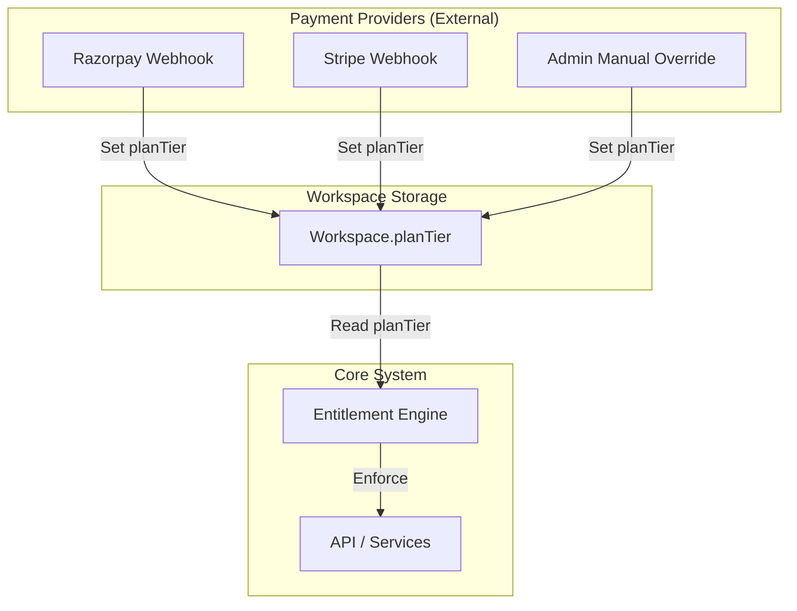

# Qrezo Target Plan & Entitlement Blueprint

**Target File:** `docs/architecture/subscription-entitlement-blueprint.md`  
**Date:** August 12, 2026  
**Architect:** Principal SaaS Architect  
**Status:** Design Blueprint (No Code Execution)  

---

## 1. Objective

The objective of this architecture blueprint is to establish a unified, multi-tenant, workspace-scoped entitlement engine for Qrezo.

### Core Architecture Principle
`Workspace.planTier` is the **single source of truth** for all entitlement decisions, resource limits, and feature gating.

```
┌─────────────────┐       ┌─────────────────┐       ┌─────────────────┐       ┌────────────────────────┐
│    Workspace    │ ───►  │    PlanTier     │ ───►  │  Entitlement    │ ───►  │ Resource Limits &      │
│  (Tenant Scope) │       │ (Free/Pro/Biz)  │       │  Engine         │       │ Feature Gating         │
└─────────────────┘       └─────────────────┘       └─────────────────┘       └────────────────────────┘
```

### Supported Plan Tiers
1. **FREE:** Useful, non-expiring tier for individuals and small setups to experience core Qrezo value.
2. **PRO:** Tier for individual professionals, creators, and single event organizers needing higher limits and customization.
3. **BUSINESS:** Tier for agencies, businesses, and enterprise teams requiring team collaboration, API/webhook access, high attendee volumes, and scanner devices.
4. **ENTERPRISE:** Retained in Mongoose `Workspace` enum schema for future custom contracts (detailed logic deferred).

---

## 2. Current vs. Target Architecture

Based on the audit (`docs/architecture/current-subscription-audit.md`), the repository currently suffers from dual plan state (`User.subscriptionPlan` vs. `Workspace.planTier`), hard-coded limits in `lib/pricing.ts`, and single-resource checks inside `lib/guards/subscriptionGuard.ts`.

### Architecture Evolution Overview

```
[ CURRENT ARCHITECTURE ]
User.subscriptionPlan ───► subscriptionGuard.ts ───► QRCode.countDocuments() ───► Hardcoded PRICING_PLANS

[ TARGET ARCHITECTURE ]
Workspace.planTier ───► Central Entitlement Engine ───► Feature Gates / Resource Meters ───► Central Plan Config
```

### Component Transition Table

| Component | Current State | Target State | Action |
| :--- | :--- | :--- | :--- |
| `Workspace.planTier` | Existing in model schema, un-synced on plan upgrade | Primary source of truth for all plan entitlements | **Retain & Elevate** |
| `User.subscriptionPlan` | Read by `subscriptionGuard.ts` | Legacy compatibility field; synced to workspace plan during migration | **Deprecate for Entitlements** |
| `lib/pricing.ts` | Mixed metadata & hardcoded QR limits | Replaced by structured `config/plans.config.ts` | **Replace** |
| `lib/guards/subscriptionGuard.ts` | Procedural function checking only QR codes against User plan | Replaced by modular `EntitlementService` checking Workspace plan | **Replace / Deprecate** |
| `core/workspace/resolveWorkspace.ts` | Resolves `workspaceId`, `userId`, `role` | Extended to provide `planTier` context | **Retain & Extend** |
| `models/Subscription.ts` | Transaction history tied to `userId` | Add `workspaceId` reference for multi-tenant billing history | **Migrate Schema Later** |

---

## 3. Plan Matrix

The following matrix defines the target entitlements across all Qrezo resources and features.

> [!IMPORTANT]
> Unjustified or speculative values derived beyond current repository implementation are explicitly marked as `PROPOSED — NEEDS PRODUCT DECISION`.

| Resource / Feature | FREE Plan | PRO Plan | BUSINESS Plan | Status / Justification |
| :--- | :--- | :--- | :--- | :--- |
| **Active Dynamic QR Codes** | **3** | **50** | **1,000** | PROPOSED — NEEDS PRODUCT DECISION (Audit showed Free: 3, Pro: 5, Biz: 1M) |
| **Smart Pages / Review Pages** | **1** | **10** | **100** | PROPOSED — NEEDS PRODUCT DECISION (Currently un-gated) |
| **Active Events** | **1** | **5** | **50** | PROPOSED — NEEDS PRODUCT DECISION (Currently un-gated) |
| **Attendees per Event** | **50** | **500** | **10,000** | PROPOSED — NEEDS PRODUCT DECISION (Currently un-gated) |
| **Scanner Devices per Event** | **1** | **3** | **20** | PROPOSED — NEEDS PRODUCT DECISION (Currently un-gated) |
| **API Keys per Workspace** | **0** (Disabled) | **2** (Test Only) | **10** (Test & Live) | PROPOSED — NEEDS PRODUCT DECISION (Audit showed un-gated API keys) |
| **Webhook Endpoints** | **0** (Disabled) | **2** | **10** | PROPOSED — NEEDS PRODUCT DECISION (Currently un-gated) |
| **Notification Templates** | **1** (System default) | **5** | **25** | PROPOSED — NEEDS PRODUCT DECISION (Currently un-gated) |
| **Workspaces per Account** | **1** | **3** | **10** | PROPOSED — NEEDS PRODUCT DECISION (Currently un-gated) |
| **Developer API Access** | **Disabled** | **Read-Only / Test** | **Full Access** | PROPOSED — NEEDS PRODUCT DECISION (UI claims Business feature) |
| **Event Analytics** | **Basic** (Total counts) | **Standard** (Charts, CSV export) | **Advanced** (Real-time telemetry) | PROPOSED — NEEDS PRODUCT DECISION |
| **QR Scan Analytics** | **Basic** (Scan count) | **Full** (Geo, Device, OS) | **Full** (Geo, Device, OS, API) | Matches `PRICING_PLANS` definitions |
| **Custom Branding / Logo** | **Disabled** (Qrezo watermark) | **Enabled** (Custom logo/colors) | **Enabled** (Custom logo/colors) | Matches `PRICING_PLANS` UI specification |
| **Custom Domains / White Label** | **Disabled** | **Disabled** | **Enabled** | Matches Workspace model `customDomain` field |
| **External Integrations / Qrezo Connect** | **Disabled** | **Basic** (Webhooks) | **Advanced** (Webhooks + API) | PROPOSED — NEEDS PRODUCT DECISION |

---

## 4. Free Plan Strategy

The **Free Plan** is engineered to serve as a high-conversion sandbox that introduces users to Qrezo's value proposition without incurring high infrastructure costs.

### What Free Users CAN Do:
- Create 1 Workspace.
- Generate up to 3 Active Dynamic QR Codes.
- Create 1 Smart Page / Review Page using standard themes.
- Create 1 Active Event with up to 50 Attendees.
- Pair 1 Scanner Device for entry validation.
- View basic scan counts and attendance summaries.

### What Free Users CANNOT Do:
- Remove Qrezo branding or add custom logos/colors to QR codes.
- Create API keys or access Developer APIs.
- Configure Webhook endpoints or custom Notification templates.
- Use custom domains.
- Create additional events or QR codes once initial limits are reached.

### Upgrade Prompt Placement (UX Points):
1. **QR Creation Limit Reached:** Modal on `CreateQRForm` when 3 QRs exist.
2. **Branding Customization:** Lock icon on logo upload / color picker in QR Generator & Smart Page Builder.
3. **Developer Tab / Webhooks:** Banner on Developer Settings tab ("Upgrade to Business to generate API keys & Webhooks").
4. **Event Attendee Limit:** Toast notification when manual registration or CSV import exceeds 50 attendees.

---

## 5. Feature Entitlements vs. Resource Limits

The entitlement engine enforces two distinct conceptual primitives:

```
                                ┌─────────────────────────────────────────┐
                                │        Central Entitlement Engine       │
                                └─────────────────────────────────────────┘
                                     │                               │
                  ┌──────────────────┴──┐                 ┌──────────┴─────────────────┐
                  ▼                     ▼                 ▼                            ▼
        [ FEATURE ENTITLEMENTS ]  (Boolean Gates)     [ RESOURCE LIMITS ]   (Numerical Thresholds)
        - api_access: false                           - max_qr_codes: 3
        - custom_branding: false                      - max_events: 1
        - webhooks_enabled: false                     - max_attendees_per_event: 50
```

### Conceptual Service API Specification

Do **NOT** implement code now; use these signatures for future service implementation:

```typescript
export interface IEntitlementService {
    /** Checks if a boolean feature is enabled for a workspace. */
    canUseFeature(workspaceId: string, featureKey: FeatureKey): Promise<boolean>;

    /** Gets the maximum allowed quota for a numerical resource. */
    getLimit(workspaceId: string, resourceKey: ResourceKey): Promise<number>;

    /** Calculates current active usage for a resource in a workspace. */
    getUsage(workspaceId: string, resourceKey: ResourceKey, context?: Record<string, string>): Promise<number>;

    /** Throws ForbiddenError (403) if a feature is not enabled. */
    assertFeature(workspaceId: string, featureKey: FeatureKey): Promise<void>;

    /** Throws ForbiddenError (403) if current usage >= limit. */
    assertWithinLimit(workspaceId: string, resourceKey: ResourceKey, context?: Record<string, string>): Promise<void>;
}
```

---

## 6. Resource Scoping Architecture

Every resource in Qrezo must be explicitly scoped to maintain strict multi-tenant isolation.

| Resource | Scope Level | Scope Rationale |
| :--- | :--- | :--- |
| **QR Codes** | Workspace | QRs belong to a workspace brand; limits apply across the entire team tenant. |
| **Smart Pages** | Workspace | Smart Pages are branding micro-sites belonging to the workspace. |
| **Events** | Workspace | Events are organized by the workspace entity. |
| **Attendees** | Event & Workspace | Attendees are registered to a specific Event (`eventId`), with upper limits per Event. |
| **Scanner Devices** | Event & Workspace | Scanner hardware is paired to validate entry for a specific Event. |
| **API Keys** | Workspace | Developer credentials grant access to workspace data. |
| **Webhooks** | Workspace | Webhook endpoints deliver domain events for the entire workspace. |
| **Notifications** | Workspace | Templates control messaging for workspace-triggered events. |
| **Workspaces** | User / Account | Workspace creation is controlled at the account/user level. |

---

## 7. Usage Calculation Definitions

To ensure consistency across count queries and avoid performance bottlenecks:

| Resource | Usage Count Query Concept | Inactive / Soft-Deleted | Historical Records | Archived Records |
| :--- | :--- | :--- | :--- | :--- |
| **QR Codes** | `QRCode.countDocuments({ workspaceId, isActive: true })` | Excluded | Excluded | Excluded |
| **Smart Pages** | `SmartPage.countDocuments({ workspaceId })` | Excluded if deleted | Included | Included |
| **Events** | `Event.countDocuments({ workspaceId, status: { $ne: "archived" } })` | Excluded | Included | Excluded |
| **Attendees** | `Attendee.countDocuments({ workspaceId, eventId })` | Excluded if deleted | Included | Included |
| **Scanner Devices** | `ScannerDevice.countDocuments({ workspaceId, eventId, status: { $ne: "disabled" } })` | Excluded | Excluded | Excluded |
| **API Keys** | `ApiKey.countDocuments({ workspaceId, revokedAt: null })` | Excluded | Excluded | Excluded |
| **Webhooks** | `WebhookEndpoint.countDocuments({ workspaceId, enabled: true })` | Excluded | Excluded | Excluded |
| **Notifications** | `NotificationTemplate.countDocuments({ workspaceId })` | Excluded | Included | Included |

---

## 8. Resource Limit Enforcement & Downgrade Strategy

### Reaching a Limit (Creation Blocked)
When a workspace reaches its limit for a resource (e.g., 3/3 QRs on Free):
- **New Creation:** Blocked with a `403 Forbidden` (`plan_limit_reached`).
- **Existing Resources:** Remain **fully operational**, published, and editable.

### Downgrade Strategy (Pro/Business $\rightarrow$ Free)
If a workspace downgrades from Pro (e.g., 10 events) to Free (limit 1 event):

> [!TIP]
> **Least Destructive SaaS Rule:** Never delete or alter user-created data upon plan downgrade.

1. **No Data Deletion:** Existing events, QR codes, attendees, and pages are **retained intact**.
2. **Access State:** Existing active resources remain readable and functional.
3. **Creation Freeze:** Creation of *new* resources is blocked until usage drops below the Free limit.
4. **Feature Lock:** Premium features (e.g., API access, Webhooks, Custom Logos) revert to disabled state on next request.

---

## 9. Plan Transition Flow

Plan transitions are currently managed via Admin controls or payment webhooks:

```
                      ┌────────────────────────────────────────┐
                      │    User Upgrades / Admin Updates Plan  │
                      └────────────────────────────────────────┘
                                           │
                                           ▼
                      ┌────────────────────────────────────────┐
                      │    Update Workspace.planTier in DB     │
                      └────────────────────────────────────────┘
                                           │
                                           ▼
                      ┌────────────────────────────────────────┐
                      │ Cache Invalidation / Next Request Read │
                      └────────────────────────────────────────┘
                                           │
                                           ▼
                      ┌────────────────────────────────────────┐
                      │ Entitlement Engine Grants New Limits   │
                      └────────────────────────────────────────┘
```

- **Free $\rightarrow$ Pro / Pro $\rightarrow$ Business (Upgrade):** `Workspace.planTier` updated immediately. Higher limits and feature flags take effect instantly.
- **Business $\rightarrow$ Pro / Pro $\rightarrow$ Free (Downgrade):** `Workspace.planTier` updated. Creation freezes apply if current resource count exceeds new limits.

---

## 10. User vs. Workspace Plan Migration Strategy

To resolve the dual source of truth identified in the audit (`User.subscriptionPlan` vs. `Workspace.planTier`):

```
┌──────────────────────────────────────────────────────────────────────────────┐
│                            MIGRATION STRATEGY                                │
├──────────────────────────────────────────────────────────────────────────────┤
│ 1. Workspace.planTier = SINGLE SOURCE OF TRUTH for all entitlement checks.   │
│ 2. User.subscriptionPlan = LEGACY COMPATIBILITY FIELD during migration.       │
└──────────────────────────────────────────────────────────────────────────────┘
```

### Migration Execution Plan:
1. **Existing Workspaces Backfill:** Execute a one-time migration script that inspects `Workspace.ownerId` -> `User.subscriptionPlan` and updates `Workspace.planTier = user.subscriptionPlan` for all existing owner workspaces.
2. **Multi-Workspace Owners:** If a user on `pro` owns 3 workspaces, all owned workspaces inherit `planTier = "pro"`. Workspaces where the user is merely a member retain their own `planTier`.
3. **Admin Updates:** Modify `app/api/admin/users/route.ts` so updating a user's plan also updates `Workspace.planTier` for all workspaces owned by that user (`Workspace.updateMany({ ownerId: userId }, { planTier })`).
4. **Deprecation Phase:** Keep `User.subscriptionPlan` in schema for backwards compatibility, but remove all reads from guard logic.

---

## 11. Payment System Decoupling Boundary

The entitlement engine must remain strictly decoupled from payment providers (Razorpay, Stripe).



### Decoupling Rules:
- The Entitlement Engine **only reads `Workspace.planTier`**. It has zero awareness of Stripe session IDs, Razorpay order IDs, or prices.
- Payment webhooks are simple event handlers whose sole responsibility is mapping a payment customer to a `workspaceId` and executing `Workspace.updateOne({ _id: workspaceId }, { planTier })`.

---

## 12. Safe Admin Plan Testing Mechanism

For development and internal testing prior to automated Stripe billing:

1. **Admin Override API:** Expose `PATCH /api/admin/workspaces/[workspaceId]/plan` (restricted to `session.user.role === "admin"`).
2. **Payload:** `{ planTier: "free" | "pro" | "business" }`.
3. **Security:** Regular workspace owners or members cannot call this endpoint.
4. **Audit Trail:** Log admin plan changes to console/logger for auditability.

---

## 13. Entitlement Error Model

Entitlement errors must follow the existing `AppError` and `handleApiError` architecture without breaking client responses.

### Error Codes
- `plan_limit_reached`: Resource count reached for current plan.
- `feature_not_available`: Feature is disabled on current plan.
- `plan_required`: Action requires a specific minimum plan tier.

### Standardized JSON Error Response (HTTP 403)
```json
{
  "success": false,
  "error": {
    "code": "plan_limit_reached",
    "message": "Workspace active QR code limit reached (3/3). Upgrade to Pro to create more.",
    "details": {
      "resource": "qr_codes",
      "currentUsage": 3,
      "limit": 3,
      "currentPlan": "free",
      "requiredPlan": "pro"
    }
  }
}
```

---

## 14. Enforcement Point Mapping

Map of exact API routes and services identified in the audit where entitlement assertions will be added:

| Resource Action | Target Service / API Route | Assertion Call |
| :--- | :--- | :--- |
| **Generate QR Code** | `app/api/qr/generate/route.ts` | `EntitlementService.assertWithinLimit(workspaceId, "qr_codes")` |
| **Custom QR Branding** | `app/api/qr/generate/route.ts` | `EntitlementService.assertFeature(workspaceId, "custom_branding")` |
| **Create Smart Page** | `modules/smartpage/service.ts` (`createSmartPage`) | `EntitlementService.assertWithinLimit(workspaceId, "smart_pages")` |
| **Create Event** | `modules/event/service.ts` (`createEvent`) | `EntitlementService.assertWithinLimit(workspaceId, "events")` |
| **Register / Import Attendee** | `modules/attendee/service.ts` (`createAttendee`, `bulkImport`) | `EntitlementService.assertWithinLimit(workspaceId, "attendees", { eventId })` |
| **Pair Scanner Device** | `modules/scanner-device/service.ts` (`createPairing`) | `EntitlementService.assertWithinLimit(workspaceId, "scanners", { eventId })` |
| **Create API Key** | `app/api/v2/developer/api-keys/route.ts` | `EntitlementService.assertFeature(workspaceId, "api_access")` |
| **Create Webhook** | `app/api/v2/developer/webhooks/route.ts` | `EntitlementService.assertFeature(workspaceId, "webhooks")` |
| **Create Notification Template** | `app/api/v2/developer/notifications/route.ts` | `EntitlementService.assertFeature(workspaceId, "notifications")` |

---

## 15. Qrezo Connect Entitlement Position

**Qrezo Connect** is planned as an integration suite connecting Qrezo with external platforms (CRM, Slack, Zapier, Webhooks).

> [!NOTE]
> **PROPOSED — NEEDS PRODUCT DECISION:** Future positioning of Qrezo Connect:
> - **FREE:** Disabled.
> - **PRO:** Basic webhooks & 1 active connection.
> - **BUSINESS:** Unlimited connections, custom API integrations, and two-way sync.

---

## 16. Performance & Indexing Strategy (V1)

For V1, performance must remain simple and lightweight:

- **Query Execution:** Standard MongoDB `countDocuments()` queries executed on demand. No Redis caching or background workers.
- **Recommended Database Indexes:**
  Add the following compound indexes to support fast count queries:
  - `QRCode`: `{ workspaceId: 1, isActive: 1 }`
  - `Event`: `{ workspaceId: 1, status: 1 }`
  - `Attendee`: `{ workspaceId: 1, eventId: 1 }`
  - `ScannerDevice`: `{ workspaceId: 1, eventId: 1, status: 1 }`
  - `ApiKey`: `{ workspaceId: 1, revokedAt: 1 }`
  - `WebhookEndpoint`: `{ workspaceId: 1, enabled: 1 }`

---

## 17. Security Architecture

1. **Server-Side Authority:** Client-side plan states, local storage, or request parameters are strictly UI hints. Server-side middleware/services **must** re-verify `Workspace.planTier` from DB.
2. **Context Resolution:** The backend MUST resolve context securely via `resolveWorkspace()` -> `Workspace.findById(workspaceId).select("planTier")`.
3. **No Parameter Tampering:** Users cannot bypass limits by passing `planTier="business"` in request headers or body payload.

---

## 18. Implementation Roadmap (Phases)

```
Phase 1: Central Plan Configuration (config/plans.config.ts)
   │
Phase 2: Central Entitlement Service (modules/entitlement/service.ts)
   │
Phase 3: Database Indexing & Workspace Plan Sync Helper
   │
Phase 4: Migrate QR Code Guard to Entitlement Engine
   │
Phase 5: Implement Resource Limit Checks (Events, Pages, Attendees, Scanners)
   │
Phase 6: Implement Feature Gating Checks (APIs, Webhooks, Branding)
   │
Phase 7: Admin Plan Management API & UI Upgrade Prompts
```

---

## 19. Open Product Decisions

The following items are unresolved business rules requiring explicit Product Manager approval before coding:

1. **Exact Resource Limits:** Confirm proposed numbers for Free (3 QRs, 1 Event, 50 Attendees), Pro (50 QRs, 5 Events, 500 Attendees), and Business (1000 QRs, 50 Events, 10,000 Attendees).
2. **Attendee Limit Scope:** Confirm whether attendee limits are enforced **per Event** or **workspace-wide total**.
3. **Downgrade Policy:** Confirm that downgraded workspaces retain read-only access to existing data without automated deletion.
4. **Qrezo Connect Scope:** Confirm feature availability across Pro and Business tiers.

---

## 20. Final Architectural Recommendation Summary

- **CURRENT ARCHITECTURE:** Fragmented, user-level plan checks in `subscriptionGuard.ts` checking only QR codes against un-synced `User.subscriptionPlan`.
- **TARGET ARCHITECTURE:** Centralized, multi-tenant `EntitlementService` reading `Workspace.planTier` as the single source of truth, enforcing feature gates and resource quotas across all platform modules.
- **MIGRATION STRATEGY:** Seamless backfill of `Workspace.planTier` from owner's plan, preserving legacy fields during transition without data loss.
- **IMPLEMENTATION ORDER:** Incremental 7-phase rollout starting with plan configuration and service modules before attaching API guards.
- **OPEN PRODUCT DECISIONS:** Resource limit thresholds and attendee scope pending final approval.
