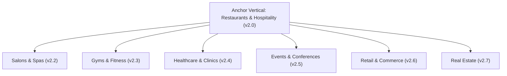
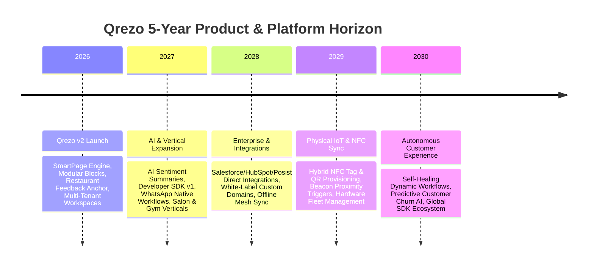

# 00. Product Vision: Qrezo v2

## 1. Executive Summary

**Qrezo v2** represents the evolution of Qrezo from a traditional static/dynamic QR code generator into an **Enterprise Smart QR Business Platform**. In Qrezo v1, a QR code was simply a static point-to-point dynamic redirect tool. In Qrezo v2, every QR code is transformed into an interactive, context-aware, programmable customer touchpoint powered by the **Smart Page Engine** and **Modular Block System**.

By anchoring our initial vertical launch around **Restaurant Feedback & Experience Management**, Qrezo v2 immediately solves high-friction operational pain points for local businesses (capturing negative feedback privately, boosting 5-star Google Reviews, table-level analytics). Simultaneously, the underlying platform architecture is generalized to support any offline-to-online (O2O) interaction across retail, healthcare, hospitality, gyms, events, real estate, and education.

---

## 2. Vision & Mission Statements

### Product Vision
> To make every offline physical interaction between a business and a human programmable, measurable, and intelligent.

### Mission Statement
> To empower physical businesses with dynamic mobile micro-experiences and automated action workflows triggered by a single QR scan—without requiring native app downloads or engineering resources.

---

## 3. The Strategic Pivot: From Utility to Platform

```
┌──────────────────────────────────────┐       ┌────────────────────────────────────────────────────────┐
│           Qrezo v1 (Utility)         │       │                 Qrezo v2 (Platform)                    │
├──────────────────────────────────────┤       ├────────────────────────────────────────────────────────┤
│ • Static Dynamic URL Redirection     │       │ • Programmable Mobile Micro-Pages (SmartPages)        │
│ • Basic Scan Count & Location Logs   │  ───► │ • Real-Time Feedback Routing & Incident Escalation    │
│ • Custom Visual Styling (Colors/Logo)│       │ • Modular Block Ecosystem (Form, Reviews, Offers, AI) │
│ • Single User Accounts               │       │ • Multi-Tenant Team Workspaces & Role-Based Security   │
└──────────────────────────────────────┘       └────────────────────────────────────────────────────────┘
```

### Strategic Differentiators
1. **Zero-App Micro-Experiences:** High-performance, edge-rendered mobile pages that load in under 100ms.
2. **Closed-Loop Feedback Routing:** Automatically route dissatisfied customers to private internal resolution while directing satisfied customers to public review channels (Google Reviews, TripAdvisor).
3. **Multi-Tenant Workspaces:** Support for multi-location brands, franchises, and agencies with centralized role-based governance.
4. **Context-Aware Dynamic Rules:** Change QR destination and block content dynamically based on time of day, customer language, scan frequency, device OS, or table location.
5. **AI-Powered Customer Intelligence:** Automated sentiment analysis, trend identification, and automated response generation for store managers.

---

## 4. Vertical Expansion Strategy

Qrezo v2 uses a **Vertical Anchor Strategy**. We launch with a hyper-focused, high-demand vertical (Restaurants & Dining), while ensuring the core data structures (`Workspace`, `SmartPage`, `Block`, `WorkflowRule`) remain completely industry-agnostic.



### Industry Vertical Matrix

| Vertical | Primary Core Block | Key Business Outcome | Triggered Workflow |
| :--- | :--- | :--- | :--- |
| **Restaurants & Hospitality** | Feedback Block, Menu Block, Review Booster | Boost Google Reviews, Capture Negative Reviews Privately | Immediate SMS/WhatsApp alert to Duty Manager if score < 4 stars |
| **Salons & Spas** | Booking Block, Stylist Feedback | Repeat Appointment Booking, Stylist Tip Collection | Follow-up WhatsApp 2 hours post-service with re-booking discount |
| **Gyms & Fitness** | Equipment Fault Block, Trainer Rate | Immediate Maintenance Dispatch, Class Attendance | Slack alert to Operations Team for broken equipment |
| **Healthcare & Clinics** | Patient Intake Block, Doctor Rating | Wait-time Optimization, Patient Satisfaction | Integration with EMR via API SDK |
| **Events & Festivals** | Agenda Block, Wi-Fi Access, Lead Capture | Audience Engagement, Sponsor Click-Tracking | Real-time lead synchronization to CRM (HubSpot/Zapier) |
| **Retail & Showrooms** | Product Spec Block, Warranty Claim | Digital Product Catalog, Instant Registration | Automated digital receipt and warranty certificate via WhatsApp |
| **Real Estate** | Property Tour Video Block, Agent Inquiry | Instant Agent Contact, Digital Brochure | Automated lead routing to property listing agent |

---

## 5. 5-Year Product Horizon Roadmap



---

## 6. Core Product Pillars

1. **Lightning-Fast Core Runtime:** QR scan resolution must occur in `< 50ms`; SmartPages must render with zero layout shift in `< 100ms`.
2. **Extensible Modular Architecture:** All micro-page content consists of decoupled, versioned "Blocks" that can be created, configured, and re-ordered independently.
3. **Action-Oriented Workflows:** A scan is not just an analytic event; it is an event trigger that can fire alerts, route traffic, log tickets, or execute AI workflows.
4. **Uncompromising Security & Multi-Tenancy:** Strict data isolation per Workspace, robust Role-Based Access Control (RBAC), and enterprise audit trails.
5. **Pragmatic Developer Experience:** Clean TypeScript APIs, clear modular monolith code boundaries, and structured developer SDKs.
