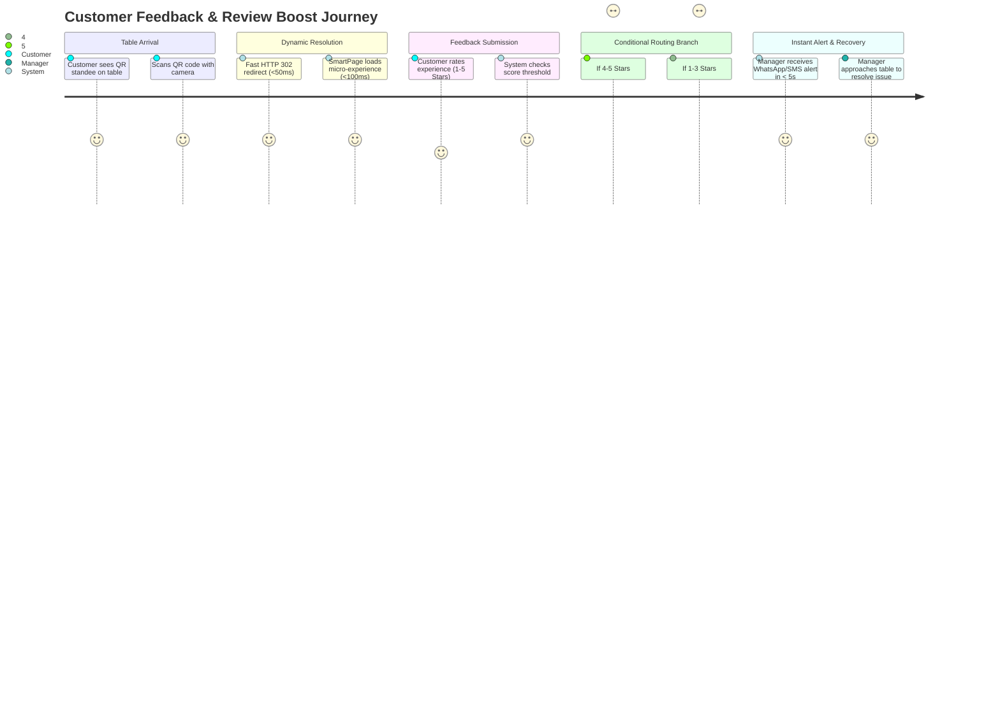

# 01. Product Requirements Document (PRD): Qrezo v2

## 1. Document Control & Metadata

| Attribute | Details |
| :--- | :--- |
| **Document Owner** | Principal Product Manager (Qrezo Inc.) |
| **Status** | Approved for Implementation |
| **Target Launch** | Q3 2026 |
| **Target Audience** | Engineering, Product, Design, Operations, Sales |
| **Version** | 2.0.0-PROD |

---

## 2. Vision & Problem Statement

### Vision
Transform offline physical foot traffic into measurable, programmable digital customer micro-experiences that drive revenue, boost online reputation, and prevent customer churn.

### Problem Statement
Physical business owners (restaurant managers, salon directors, store owners) face three major friction points in customer engagement:
1. **Uncaptured Customer Discontent:** 96% of unhappy customers leave without complaining to management; instead, they post damaging 1-star public reviews on Google/Yelp.
2. **Low Review Volume:** Satisfied customers rarely leave public reviews unless prompted immediately at the point of experience.
3. **Static & Fragmented Tools:** Traditional dynamic QR codes lead to static links or PDF menus with zero interactivity, no conditional logic, and no automated alert mechanisms.

---

## 3. Target User Personas

| Persona ID | Role / Title | Context & Pain Points | Key Goals | Primary Surface Used |
| :--- | :--- | :--- | :--- | :--- |
| **P-01** | **Restaurant General Manager (Single/Multi-Location)** | Manages daily floor operations. Worried about bad Google reviews and slow staff response times. Has zero technical expertise. | Wants instant alerts when a table gives low ratings so they can fix the issue before the guest leaves. | Mobile Web Dashboard & WhatsApp Alerts |
| **P-02** | **Franchise Marketing Director** | Oversees 25+ restaurant locations. Needs consistent branding, centralized performance oversight, and team access delegation. | Standardize landing pages across locations, audit rating trends by location, control team permissions. | Desktop Admin Workspace Dashboard |
| **P-03** | **Dine-In Customer (End User)** | Scans table QR code on personal mobile device over cellular connection (3G/4G/5G). Wants quick service/feedback. | Zero friction: no app download, page must load in < 1 second, clean mobile UI. | Mobile Browser (iOS Safari / Android Chrome) |
| **P-04** | **Platform Engineer / Developer** | Integrates Qrezo v2 API into POS systems or custom CRM workflows. | Needs robust REST APIs, webhooks, explicit rate limits, and clear SDK documentation. | Developer Portal & SDK |

---

## 4. End-to-End Customer Journey Map



---

## 5. Functional Requirements Matrix

| ID | Module | Feature Description | Priority | Target User |
| :--- | :--- | :--- | :--- | :--- |
| **FR-01** | **Workspace** | Multi-tenant organization accounts with member role delegation (Owner, Admin, Manager, Staff, Viewer). | Must Have (P0) | P-01, P-02 |
| **FR-02** | **SmartPage** | Drag-and-drop micro-page builder rendering responsive, mobile-first micro-landings. | Must Have (P0) | P-01, P-02 |
| **FR-03** | **Block System** | Extensible block container supporting Feedback, Ratings, Google Redirect, Offers, Contact, Social, Video. | Must Have (P0) | P-01, P-02, P-03 |
| **FR-04** | **Smart Routing** | Conditional routing logic: Rating ≥ 4 redirects to Google Review; Rating ≤ 3 routes to internal manager alert form. | Must Have (P0) | P-01, P-03 |
| **FR-05** | **Alert Engine** | Multi-channel alert dispatcher (WhatsApp, Email, Webhook) triggered instantly on low ratings. | Must Have (P0) | P-01, P-02 |
| **FR-06** | **Table Metadata** | Query-string parameter matching (`?table=12`, `?location=downtowneast`) dynamically mapped to feedback logs. | Should Have (P1) | P-01, P-03 |
| **FR-07** | **AI Insights** | Sentiment summary extraction and automated response draft generation for store managers. | Should Have (P1) | P-01, P-02 |
| **FR-08** | **Analytics** | Scans, feedback volume, sentiment breakdown, conversion rates, and location performance comparisons. | Must Have (P0) | P-01, P-02 |
| **FR-09** | **Public SDK & Webhooks**| HMAC-signed webhooks for `feedback.created`, `qr.scanned`, and REST endpoints for custom developer integrations. | Could Have (P2) | P-04 |

---

## 6. Non-Functional Requirements (NFRs)

| NFR ID | Category | Metric / Specification | Standard |
| :--- | :--- | :--- | :--- |
| **NFR-01** | **Redirect Latency** | QR short URL redirect processing time. | **P99 < 50ms**, **P95 < 25ms** |
| **NFR-02** | **Page Render Speed** | SmartPage Largest Contentful Paint (LCP) on mobile 4G. | **< 1000ms** (Target: 400ms) |
| **NFR-03** | **Availability** | System Uptime SLA for Redirect & SmartPage rendering. | **99.95% Availability** |
| **NFR-04** | **Security & Isolation** | Multi-tenant database boundary isolation. | Mandatory Workspace ID filtering on all DB queries |
| **NFR-05** | **Scale Capacity** | System capacity for concurrent QR scan redirections. | **1,000 requests/sec** baseline capacity |

---

## 7. User Stories with Acceptance Criteria

### User Story US-01: Conditional Feedback Routing
> **As a** Restaurant General Manager (P-01),  
> **I want** customers who rate their meal 1, 2, or 3 stars to be shown a private feedback form, while 4 and 5-star ratings redirect to our Google Review page,  
> **So that** I can catch and fix bad experiences privately before they become public bad reviews.

#### Acceptance Criteria:
1. When a user scans the QR code, the SmartPage loads with a 5-star rating block.
2. If the user selects 4 or 5 stars, the system immediately redirects the browser to the configured Google Review URL (`https://search.google.com/local/writereview?...`).
3. If the user selects 1, 2, or 3 stars, the SmartPage transitions smoothly to a detailed feedback form asking for comments, category (Food, Service, Ambience), and phone number.
4. Submission of a 1-3 star review fires a `high_priority_alert` event to the Notification Engine in `< 2 seconds`.
5. All ratings and feedback comments are persisted in the `FeedbackResponse` MongoDB collection with location and table metadata.

---

### User Story US-02: Instant Manager WhatsApp Alert
> **As a** Restaurant Duty Manager (P-01),  
> **I want** to receive a WhatsApp message on my phone within 5 seconds of a negative feedback submission,  
> **So that** I can walk over to the specific table immediately and make things right.

#### Acceptance Criteria:
1. Notification Rule accepts manager phone number in E.164 format (`+14155552671`).
2. Message template includes: Restaurant Name, Table/Location Number, Rating Score, Customer Comment, and Customer Contact Number.
3. Message delivery fails over to Email if WhatsApp dispatch returns an API error.

---

## 8. Business Rules & Edge Cases

### Business Rules
- **BR-01:** Free tier workspaces are restricted to 1 Workspace, 3 Dynamic QRs, 1 SmartPage, and basic email notifications.
- **BR-02:** Negative rating thresholds default to $\le 3$ stars, but must be customizable per SmartPage block configuration (e.g., set threshold to $\le 2$ or $\le 4$).
- **BR-03:** A user cannot submit duplicate feedback from the same IP/Device within 60 seconds (Anti-spam rate limit).

### Edge Cases & Fallbacks
- **EC-01: Offline or Weak Mobile Signal:** SmartPage static bundle must use offline-friendly service worker cache for assets; form submissions auto-retry on re-established connection.
- **EC-02: Invalid or Missing Google Review URL:** If a 5-star rating is given but no Google Review URL is configured, system gracefully shows a customized "Thank You" message block instead of crashing or redirecting to `404`.
- **EC-03: WhatsApp API Down:** If Twilio/Meta API returns `503`, system automatically queues message for retries and immediately dispatches fallback Email notification to manager.

---

## 9. Key Performance Indicators (KPIs) & Success Metrics

```
┌────────────────────────────────────────────────────────────────────────────────────────┐
│                                   Qrezo v2 Core KPIs                                   │
├──────────────────────────────────────┬─────────────────────────────────────────────────┤
│ Metric                               │ Target Goal (12 Months Post-Launch)             │
├──────────────────────────────────────┼─────────────────────────────────────────────────┤
│ Monthly Active Workspaces (MAW)      │ > 5,000 Active Business Workspaces              │
│ Total Scans Processed / Month        │ > 10,000,000 Scans / Month                      │
│ Google Review Conversion Rate        │ > 18% of 5-star raters leave Google Review      │
│ Private Recovery Rate                │ > 40% of negative raters contacted by manager   │
│ Customer Net Retention (NDR)         │ > 125% NDR                                      │
│ SmartPage Median LCP                 │ < 450ms                                         │
└──────────────────────────────────────┴─────────────────────────────────────────────────┘
```

---

## 10. Competitor Matrix

| Feature / Dimension | Qrezo v2 | Beaconstac (Uniqode) | QR Code Generator Pro | Ovation |
| :--- | :--- | :--- | :--- | :--- |
| **Core Model** | Smart QR Platform | QR Generator Utility | QR Generator Utility | Feedback Tool |
| **Micro-Page Builder** | ✅ Yes (Modular Blocks) | ❌ Basic Templates | ❌ Basic Templates | ❌ SMS-based |
| **Smart Rating Routing**| ✅ Native | ❌ No | ❌ No | ✅ Yes |
| **Multi-Tenant Workspaces**| ✅ Native (RBAC) | ⚠️ Enterprise Tier Only| ❌ No | ⚠️ Custom Setup |
| **Edge Redirect Speed** | **< 50ms** | ~ 200ms | ~ 250ms | N/A |
| **Starting Price Point** | **$19 / mo** | $25 / mo | $35 / mo | $99 / mo |
