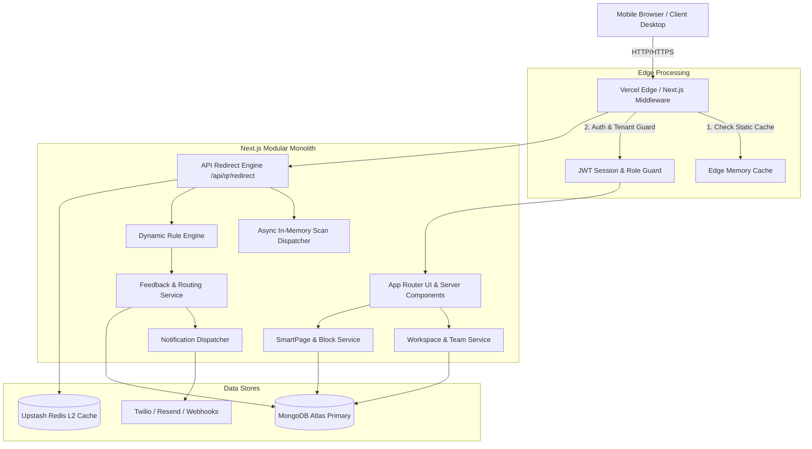
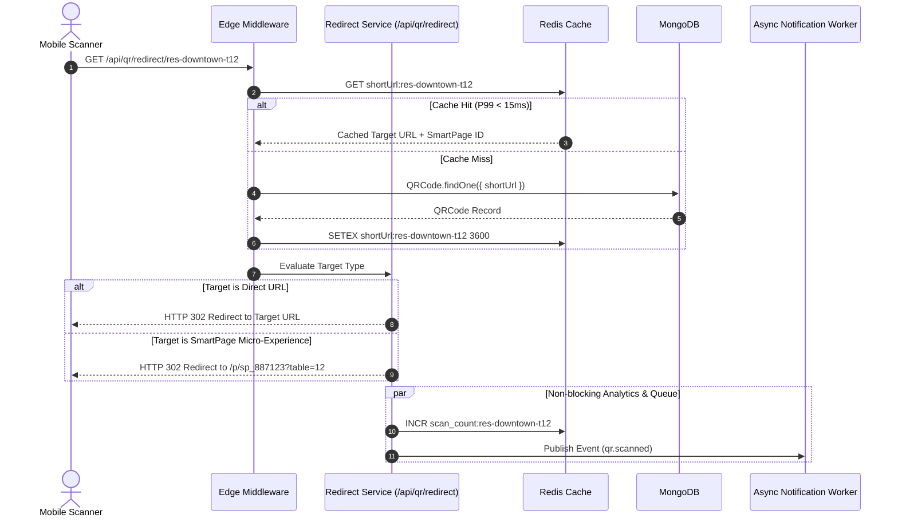

# 02. System Architecture: Qrezo v2

## 1. Architectural Philosophy: The Pragmatic Modular Monolith

Qrezo v2 deliberately avoids microservices, complex message brokers, or distributed service meshes. Microservice architectures introduce massive operational overhead, latency penalties, distributed tracing complexity, and deployment fragility—unjustified for a early/growth SaaS stage targeting high throughput.

Instead, Qrezo v2 adopts a **Pragmatic Modular Monolith** inside Next.js App Router (Node.js/TypeScript). All modules reside within a single codebase, compiled together, sharing database connections and memory space, but maintaining **strict logical module boundaries** that facilitate future extraction if ever necessary.

```
┌─────────────────────────────────────────────────────────────────────────────────────────┐
│                                Qrezo v2 Modular Monolith                                │
│                                                                                         │
│  ┌──────────────────┐  ┌──────────────────┐  ┌──────────────────┐  ┌─────────────────┐  │
│  │ Workspace Module │  │ SmartPage Engine │  │ Block System     │  │ Feedback Module │  │
│  └────────┬─────────┘  └────────┬─────────┘  └────────┬─────────┘  └────────┬────────┘  │
│           │                     │                     │                   │             │
│           └─────────────────────┼─────────────────────┴───────────────────┘             │
│                                 ▼                                                       │
│  ┌───────────────────────────────────────────────────────────────────────────────────┐  │
│  │                            Core Shared Services Layer                             │  │
│  │  (Auth Guards, DB Repository, In-Memory Event Bus, Cache Manager, Logger)        │  │
│  └──────────────────────────────────────┬────────────────────────────────────────────┘  │
└─────────────────────────────────────────┼───────────────────────────────────────────────┘
                                          ▼
                         ┌─────────────────────────────────┐
                         │   MongoDB Atlas & Upstash Redis │
                         └─────────────────────────────────┘
```

---

## 2. High-Level Architecture Blueprint



---

## 3. Strict Module Boundaries & Rules

To prevent spaghetti code, Qrezo v2 enforces strict module isolation rules:

1. **No Direct Inter-Module DB Imports:** A file inside `modules/feedback` MUST NOT directly import `models/SmartPage.ts`. It must communicate through the public service interface `modules/smartpage/service.ts`.
2. **Explicit Layering:**
   - **Presentation Layer (`app/`):** React Server Components, Route Handlers. Handles HTTP requests/responses, payload validation (Zod), and status codes.
   - **Service Layer (`services/`):** Pure business logic. Independent of Next.js HTTP primitives (`NextRequest`, `NextResponse`).
   - **Data Access Layer (`repositories/`):** Raw Mongoose queries, transactional operations, and cache lookups.
3. **In-Memory Async Event Dispatcher:** Cross-module side effects (e.g., "Feedback created" $\rightarrow$ "Trigger Notification") are decoupled using a lightweight, typed in-memory Event Emitter (`EventEmitter`).

---

## 4. Key Architectural Tradeoffs & Decision Matrix

| Dimension | Decision Chosen | Alternative Considered | Rationale & Tradeoff |
| :--- | :--- | :--- | :--- |
| **Monolith vs Microservices** | **Modular Monolith** | Microservices (Go/Node) | Monolith eliminates inter-service network latency and deployment overhead. Allows rapid feature iteration. Tradeoff: Requires code discipline to enforce boundaries. |
| **Database Engine** | **MongoDB (Mongoose)** | PostgreSQL (Prisma) | Flexible JSON document structure perfectly fits variable block schemas (each Block type has different fields). Tradeoff: Lack of strict ACID joins requires explicit multi-document transactions where needed. |
| **Queue & Worker Engine** | **Async Node Process + Redis**| AWS SQS + Lambda / RabbitMQ | Single-process async tasks are zero-cost and simple to start. Upstash Redis handles persistence if scale demands. Tradeoff: Memory crash during in-flight event risks losing non-critical scan log batch. |
| **Rendering Strategy** | **Hybrid ISR + Server API** | Full Client-Side SPA | Micro-landing pages must load in < 100ms on weak mobile connections. Server-driven rendering (RSC / ISR) delivers pre-rendered HTML/CSS directly. |

---

## 5. End-to-End Request Lifecycles

### Lifecycle 1: High-Speed QR Redirect & Feedback Trigger


---

## 6. Codebase File Structure (Target Monolith Topology)

```
/h:/smart-qr-saas/
├── app/                        # Next.js App Router (Routes & Views)
│   ├── (auth)/                 # Login / Signup Pages
│   ├── (dashboard)/            # Main User Workspace Dashboard
│   ├── (public)/               # Public Micro-Pages (/p/[pageId])
│   ├── admin/                  # Super Admin Governance Portal
│   └── api/                    # REST Route Handlers (/api/v2/*)
├── components/                 # Global UI & Block Renderers
│   ├── blocks/                 # Block UI Components (FeedbackBlock, ReviewBlock, etc.)
│   ├── builder/                # Drag-and-Drop Canvas Builder Components
│   └── ui/                     # Primitives (Buttons, Dialogs, Inputs)
├── modules/                    # Isolated Business Logic Domains
│   ├── workspace/              # Workspaces, Members, Roles, Invites
│   ├── smartpage/              # SmartPages, Layout, Block Parsing
│   ├── feedback/               # Ratings, Routing Logic, Responses
│   ├── notification/           # Channels (WhatsApp, Email, Webhook)
│   └── ai/                     # Sentiment Analysis & Summarization
├── core/                       # Shared Framework Infrastructure
│   ├── db/                     # Mongoose connection & repositories
│   ├── redis/                  # Upstash Redis client
│   ├── events/                 # Typed In-Memory Event Emitter
│   ├── middleware/             # Auth, RBAC, Rate-Limit Guards
│   └── errors/                 # Standardized Error Handling Classes
└── docs/v2/                    # Single Source of Truth Documentation
```
