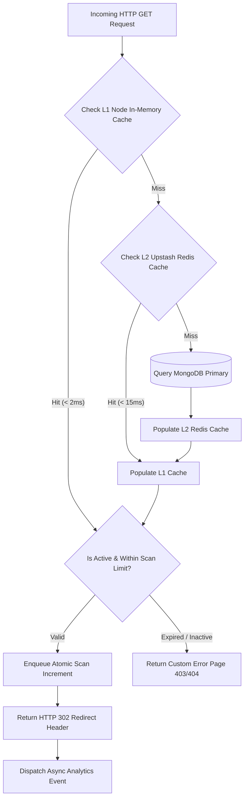
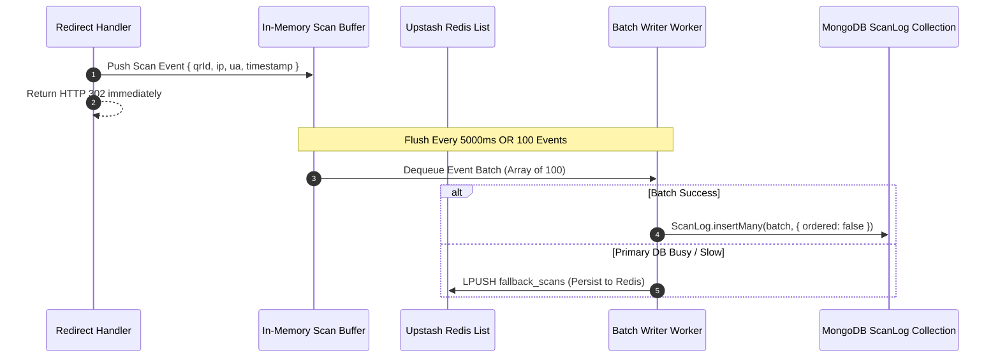

# 03. System Design: Qrezo v2

## 1. High-Volume Redirect Engine

The Redirect Engine (`/app/api/qr/redirect/[shortUrl]`) is the highest-throughput critical path in Qrezo v2. It must execute under strict SLA targets: **P99 < 50ms, P95 < 25ms**.

### Redirect Processing Sub-System



---

## 2. Multi-Layer Caching Architecture (L1 + L2)

To protect the primary MongoDB database from read saturation during viral QR scan spikes, Qrezo v2 implements a two-tier caching topology:

```
┌────────────────────────────────────────────────────────────────────────┐
│                        Two-Tier Cache Hierarchy                        │
│                                                                        │
│  [ Incoming Request ]                                                  │
│         │                                                              │
│         ▼                                                              │
│  ┌───────────────────────────────┐                                     │
│  │ L1 Cache: Node process LRU    │ ──► Hit (< 2ms): Instant Return       │
│  │ (LRUCache, max 5,000 items)   │                                     │
│  └──────────────┬────────────────┘                                     │
│                 │ Miss                                                 │
│                 ▼                                                      │
│  ┌───────────────────────────────┐                                     │
│  │ L2 Cache: Upstash Redis       │ ──► Hit (< 15ms): Populate L1 & Return│
│  │ (Distributed, TTL 3600s)      │                                     │
│  └──────────────┬────────────────┘                                     │
│                 │ Miss                                                 │
│                 ▼                                                      │
│  ┌───────────────────────────────┐                                     │
│  │ Primary Storage: MongoDB      │ ──► Hit (~ 45ms): Populate L2 & L1   │
│  └───────────────────────────────┘                                     │
└────────────────────────────────────────────────────────────────────────┘
```

### Cache Invalidation Strategy
- **Event-Driven Cache Eviction:** Whenever a user edits a QR code or SmartPage via the Dashboard, the application emits a `qr.updated` event.
- The event listener immediately issues a Redis `DEL qr:shortUrl:{shortCode}` and invalidates the local L1 cache instance across active Node runtime workers via Redis Pub/Sub invalidation messages.

---

## 3. Rate Limiting & Abuse Prevention Engine

Rate limiting protects system endpoints from denial-of-wallet and DDoS attacks across two distinct tiers:

| Target Endpoint | Rate Limit Policy | Algorithm | Storage Engine | Action on Breach |
| :--- | :--- | :--- | :--- | :--- |
| **Public QR Redirect** (`/api/qr/redirect/*`) | 300 requests / min per IP | Token Bucket | Redis Sliding Window | HTTP 429 Too Many Requests |
| **Feedback Submission** (`/api/v2/feedback`) | 5 submissions / 10 min per IP | Fixed Window | Redis / Memory | HTTP 429 + UI Error Toast |
| **Logo & Image Upload** (`/api/qr/upload-logo`) | 10 uploads / hr per User ID | Token Bucket | Redis | HTTP 429 Unauthorized Limit |
| **Authentication** (`/api/auth/*`) | 10 requests / 15 min per IP | Leaky Bucket | Redis | HTTP 429 + Recaptcha Trigger |

---

## 4. Asynchronous Task Queue & Batch Logging

Directly writing a `ScanLog` database document synchronously during an HTTP redirect adds ~30-50ms of blocking IO. Qrezo v2 moves scan logging to an **Asynchronous Batching Pipeline**:



---

## 5. Resilience, Failure Modes & System Fallbacks

```
┌─────────────────────────────────────────────────────────────────────────────────────────┐
│                                Failure Recovery Matrix                                  │
├────────────────────────┬───────────────────────────────┬────────────────────────────────┤
│ Component Failure      │ System Impact                 │ Automated Fallback Protocol    │
├────────────────────────┼───────────────────────────────┼────────────────────────────────┤
│ **MongoDB Connection** │ Cannot read/write persistent  │ Serve active QRs from Redis    │
│ **Outage**             │ records.                      │ L2 cache. Queue scan logs in   │
│                        │                               │ Redis buffer.                  │
├────────────────────────┼───────────────────────────────┼────────────────────────────────┤
│ **Redis Cache Outage** │ Higher latency on redirects   │ Bypass Redis; query MongoDB    │
│                        │ (~45ms instead of ~15ms).     │ directly. Rely on Node L1 LRU  │
│                        │                               │ cache.                         │
├────────────────────────┼───────────────────────────────┼────────────────────────────────┤
│ **Cloudinary CDN**     │ QR code images fail to render │ Fallback to client-side SVG    │
│ **Degradation**        │ in dashboard UI.              │ rendering via QR React comp.   │
├────────────────────────┼───────────────────────────────┼────────────────────────────────┤
│ **Twilio WhatsApp**    │ WhatsApp alerts fail to       │ Catch API exception; failover  │
│ **API Failure**        │ deliver to restaurant manager.│ to immediate Resend Email alert│
└────────────────────────┴───────────────────────────────┴────────────────────────────────┘
```

---

## 6. Service Level Objectives (SLOs) & SLA Metrics

| Indicator | Objective (SLO) | Breached Trigger (Alert Threshold) |
| :--- | :--- | :--- |
| **Redirect Latency** | P95 < 25ms, P99 < 50ms | P95 > 100ms for 5 consecutive minutes |
| **SmartPage LCP** | Median < 400ms on 4G | Median > 1200ms on 4G |
| **System Uptime** | 99.95% availability | > 2 minutes total downtime in 24 hours |
| **Failed Redirect Rate**| < 0.01% HTTP 5xx errors | > 0.1% HTTP 5xx over a 5-minute window |
