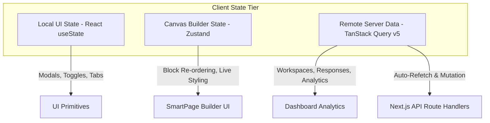

# 06. Frontend Architecture: Qrezo v2

## 1. Core Framework & Rendering Strategy

Qrezo v2 uses **Next.js 16 (App Router)** with TypeScript, Tailwind CSS v4, and React 19. The UI rendering architecture strictly splits responsibilities between React Server Components (RSC) and Client Components:

```
┌────────────────────────────────────────────────────────────────────────┐
│                      Frontend Component Architecture                   │
├───────────────────────────────────┬────────────────────────────────────┤
│ React Server Components (RSC)     │ Client Components ("use client")   │
├───────────────────────────────────┼────────────────────────────────────┤
│ • Initial Page Shell Layouts      │ • Drag-and-Drop SmartPage Builder  │
│ • Server-Side Data Fetching       │ • Interactive Block Renderers      │
│ • Workspace Permission Checks     │ • Toast Notification Triggers      │
│ • SEO Head Meta & Structured Data │ • Form Inputs & Live Preview Canvas│
└───────────────────────────────────┴────────────────────────────────────┘
```

---

## 2. State Management Architecture



### 1. Remote Server State (`@tanstack/react-query`)
- Handles server data caching, background revalidation, optimistic updates, and loading states for dashboard metrics, feedback feeds, and QR lists.
- Eliminates standard `useEffect` data fetching antipatterns.

### 2. Live Page Builder State (`zustand`)
- Manages the local draft state during drag-and-drop SmartPage customization.
- Supports undo/redo stack history without hitting the server until the user clicks **"Publish"**.

---

## 3. Drag-and-Drop SmartPage Builder Engine Architecture

```
┌─────────────────────────────────────────────────────────────────────────┐
│                     SmartPage Canvas Builder Topology                   │
│                                                                         │
│  ┌───────────────────────┐  ┌──────────────────┐  ┌──────────────────┐  │
│  │ Block Selector Drawer │  │ Live Phone Canvas│  │ Property Inspector│  │
│  │ (Header, Rating, Form)│  │ (dnd-kit context)│  │ (Colors, Links)  │  │
│  └───────────┬───────────┘  └────────┬─────────┘  └────────┬─────────┘  │
│              │                       │                     │            │
│              └───────────────────────┼─────────────────────┘            │
│                                      ▼                                  │
│                      ┌────────────────────────────────┐                 │
│                      │   Zustand Builder Store        │                 │
│                      │  - blocks: IBlock[]            │                 │
│                      │  - activeBlockId: string       │                 │
│                      │  - historyStack: IBlock[][]    │                 │
│                      └───────────────┬────────────────┘                 │
│                                      │                                  │
│                                      ▼                                  │
│                      ┌────────────────────────────────┐                 │
│                      │ PUT /api/v2/smartpages/:id     │                 │
│                      └────────────────────────────────┘                 │
└─────────────────────────────────────────────────────────────────────────┘
```

### Core Libraries
- **`@dnd-kit/core` & `@dnd-kit/sortable`:** Provides accessible, performant drag-and-drop re-ordering of page blocks.
- **`lucide-react`:** Vector icon set.
- **`framer-motion`:** Micro-animations for block insertions and interactive star rating hovers.

---

## 4. Mobile Micro-Landing Page Optimization (Public View `/p/[slug]`)

The public micro-landing page accessed by customers after scanning a QR code is engineered for maximum performance:

1. **Zero Bundle Bloat:** Public micro-pages (`/p/[slug]`) do NOT import heavy dashboard libraries (Recharts, Dnd-kit, NextAuth).
2. **Minimal CSS Footprint:** Tailored CSS stylesheet size `< 12 KB` gzipped.
3. **Optimized Asset Loading:** Logo images rendered via `next/image` using Cloudinary automated WebP/AVIF format conversions (`f_auto,q_auto`).
4. **Performance Targets:**
   - **Total Page Weight:** `< 120 KB` gzipped.
   - **First Contentful Paint (FCP):** `< 300ms` on 4G connection.
   - **Largest Contentful Paint (LCP):** `< 600ms`.
