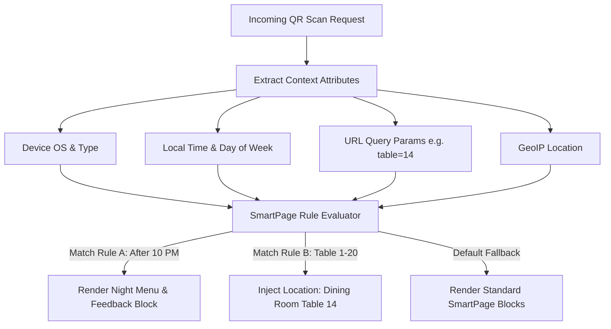

# 08. SmartPage Engine Specification: Qrezo v2

## 1. Engine Overview & Core Principles

The **SmartPage Engine** is the micro-landing execution core of Qrezo v2. It turns static QR scans into dynamic, responsive, interactive mobile applications rendered on-the-fly inside the customer's mobile browser.

### Key Objectives
- **Sub-100ms Initial Render:** Uses React Server Components (RSC) to serve HTML directly from edge nodes.
- **Dynamic Context Evaluation:** Evaluates rules before rendering to serve different blocks based on context parameters.
- **Zero App Installation:** Pure HTML5/CSS3/JavaScript compatible with iOS Safari and Android Chrome.

---

## 2. Dynamic Context Rules Engine Topology



---

## 3. Context Parameter Schema & Evaluation Contract

Before generating the block tree response for a SmartPage, the engine parses incoming context metadata:

```typescript
export interface SmartPageContext {
    timestamp: Date;
    dayOfWeek: number; // 0 (Sun) - 6 (Sat)
    hourOfDay: number; // 0 - 23
    deviceType: "mobile" | "tablet" | "desktop";
    os: string;
    browser: string;
    country: string;
    queryParams: Record<string, string>; // Capture table=12, staff=alex, campaign=summer
}
```

### Rule Evaluation Specification

SmartPages can attach conditional display rules to individual blocks or entire pages:

```typescript
export interface IContextRule {
    ruleId: string;
    condition: "time_between" | "device_equals" | "param_equals";
    parameters: {
        startTime?: string; // "22:00"
        endTime?: string;   // "04:00"
        device?: string;    // "mobile"
        paramKey?: string;  // "table"
        paramValue?: string;// "vip"
    };
    action: "show_block" | "hide_block" | "redirect_external";
    targetUrl?: string;
}
```

---

## 4. SmartPage Schema & Hydration Pipeline

```
┌────────────────────────────────────────────────────────────────────────┐
│                   SmartPage Hydration Lifecycle                        │
│                                                                        │
│  1. Request Received: GET /p/sp_bella_italia?table=12                  │
│         │                                                              │
│         ▼                                                              │
│  2. Fetch Raw SmartPage Document from MongoDB / Redis Cache             │
│         │                                                              │
│         ▼                                                              │
│  3. Evaluate Context Rules (Time, Table, Device)                       │
│         │                                                              │
│         ▼                                                              │
│  4. Filter & Re-order Visible Blocks Array (`blocks.sort(sortOrder)`)  │
│         │                                                              │
│         ▼                                                              │
│  5. Render HTML Markup via React Server Components (RSC)               │
│         │                                                              │
│         ▼                                                              │
│  6. Stream HTML Payload to Client Browser (< 100ms LCP)                │
└────────────────────────────────────────────────────────────────────────┘
```
