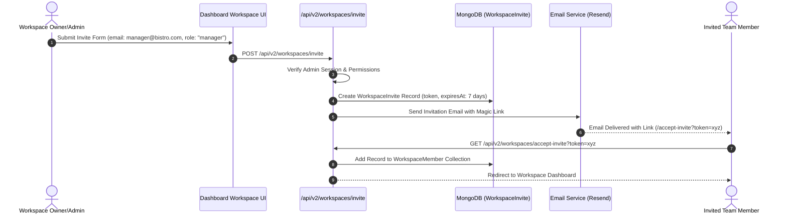

# 10. Workspace & Multi-Tenancy Architecture: Qrezo v2

## 1. Multi-Tenant Organization Hierarchy

Qrezo v2 is designed from the ground up for multi-tenancy. A single User account can create, own, or be invited into multiple **Workspaces** (e.g., "Downtown Branch", "Uptown Branch", "Agency Account").

```
┌────────────────────────────────────────────────────────────────────────┐
│                     Multi-Tenant Hierarchy Topology                    │
│                                                                        │
│                            [ User Account ]                            │
│                                   │                                    │
│        ┌──────────────────────────┴──────────────────────────┐         │
│        ▼                                                     ▼         │
│  ┌───────────────────────────┐                 ┌────────────────────┐  │
│  │ Workspace A: Bistro NYC   │                 │ Workspace B: Spa SF│  │
│  │ (Role: Owner)             │                 │ (Role: Manager)    │  │
│  └─────────────┬─────────────┘                 └─────────┬──────────┘  │
│                │                                         │             │
│   ┌────────────┴────────────┐                            │             │
│   ▼                         ▼                            ▼             │
│ ┌──────────────┐      ┌──────────────┐            ┌──────────────┐     │
│ │ QRCode Docs  │      │ SmartPage    │            │ QRCode Docs  │     │
│ └──────────────┘      └──────────────┘            └──────────────┘     │
└────────────────────────────────────────────────────────────────────────┘
```

---

## 2. Role-Based Access Control (RBAC) Permission Matrix

Qrezo v2 defines 5 granular membership roles within each Workspace:

| Permission Capability | Owner | Admin | Manager | Staff | Viewer |
| :--- | :---: | :---: | :---: | :---: | :---: |
| **Delete Workspace / Transfer Ownership** | ✅ | ❌ | ❌ | ❌ | ❌ |
| **Manage Billing & Plan Upgrades** | ✅ | ✅ | ❌ | ❌ | ❌ |
| **Invite & Remove Team Members** | ✅ | ✅ | ❌ | ❌ | ❌ |
| **Create & Edit SmartPages & QR Codes** | ✅ | ✅ | ✅ | ❌ | ❌ |
| **Configure Notification & Alert Rules** | ✅ | ✅ | ✅ | ❌ | ❌ |
| **Acknowledge / Resolve Feedback Incidents**| ✅ | ✅ | ✅ | ✅ | ❌ |
| **View Analytics & Download Reports** | ✅ | ✅ | ✅ | ✅ | ✅ |

---

## 3. Strict Multi-Tenant Data Isolation Strategy

To guarantee zero cross-tenant data leaks, **every Mongoose database query** MUST scope its search filter by `workspaceId`.

### Database Repository Protection Layer (`core/repositories/baseRepository.ts`)

```typescript
import { FilterQuery, Model, Document } from "mongoose";

export class TenantScopedRepository<T extends Document> {
    constructor(private model: Model<T>) {}

    async findByWorkspace(workspaceId: string, filter: FilterQuery<T> = {}): Promise<T[]> {
        // Mandatory enforcement of workspaceId scoping
        return this.model.find({ ...filter, workspaceId }).lean().exec() as Promise<T[]>;
    }

    async findOneByWorkspace(workspaceId: string, filter: FilterQuery<T> = {}): Promise<T | null> {
        return this.model.findOne({ ...filter, workspaceId }).lean().exec() as Promise<T | null>;
    }
}
```

---

## 4. Workspace Member Invitation Flow



---

## 5. Active Workspace Context Switching

- **Session Context:** The active `workspaceId` is passed in client requests via custom HTTP Header `X-Workspace-Id: ws_88a9123` or retrieved from default user preference.
- **Middleware Guard:** Every API route verifies that the authenticated user possesses an active `WorkspaceMember` record matching the provided `X-Workspace-Id`.
