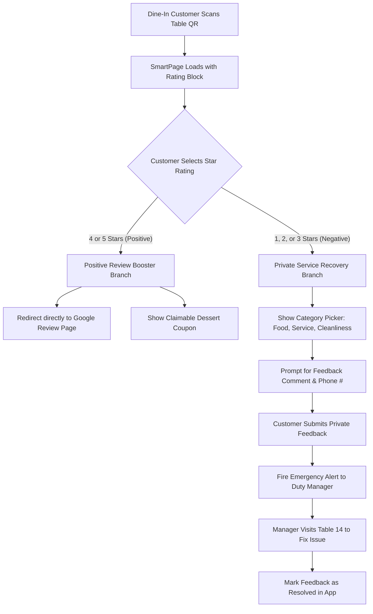

# 11. Restaurant Feedback & Experience Module: Qrezo v2

## 1. Vertical Strategy & Operational Problem Context

Restaurants operate on razor-thin operating margins where online reputation dictates business survival:
- A **0.5-star increase** on Google Reviews increases restaurant revenue by **5% to 9%** (Harvard Business School study).
- **80% of customer dissatisfaction** stems from easily fixable operational issues (cold food, slow service, wrong bill) if caught while the customer is still seated at the table.

The **Qrezo v2 Feedback Module** converts dining room table QR stands into real-time service recovery channels.

---

## 2. Closed-Loop Conditional Routing Engine



---

## 3. Table & Location Tagging Architecture

To pinpoint exact physical locations within a venue, Qrezo v2 injects dynamic URL metadata into table QR codes during batch printing:

```
https://qrezo.com/p/sp_bistro_downtown?table=14&zone=patio&waiter=alex
```

### Metadata Ingestion & Resolution Contract
When the customer submits feedback, the SmartPage engine captures these URL query parameters and persists them alongside the feedback response:

```typescript
export interface TableMetadata {
    tableNumber?: string;  // "14"
    diningZone?: string;   // "Patio" / "Main Dining" / "Bar"
    staffAttribution?: string; // "Alex"
}
```

---

## 4. Manager Incident Resolution Workflow

When a negative feedback response is recorded ($\le 3$ stars), an **Incident Lifecycle** is initialized inside the Workspace:

```
┌────────────────────────────────────────────────────────────────────────┐
│                      Incident Resolution State Machine                 │
│                                                                        │
│  [ Status: NEW ] ──► Manager notified via WhatsApp (< 5s)             │
│         │                                                              │
│         ▼                                                              │
│  [ Status: ACKNOWLEDGED ] ──► Manager taps "Acknowledge" on phone      │
│         │                     (Notifies team issue is being handled)   │
│         ▼                                                              │
│  [ Status: RESOLVED ] ──► Issue fixed at table. Manager enters        │
│                           resolution notes & marks "Resolved".        │
└────────────────────────────────────────────────────────────────────────┘
```

### Resolution Audit Fields
- `status`: `"new"` $\rightarrow$ `"acknowledged"` $\rightarrow$ `"resolved"`.
- `resolutionNotes`: "Offered free dessert and apologized. Customer left happy."
- `resolvedBy`: User ID of Duty Manager.
- `resolutionTimeSeconds`: Duration from submission to resolution (Tracked as Manager Performance KPI).
