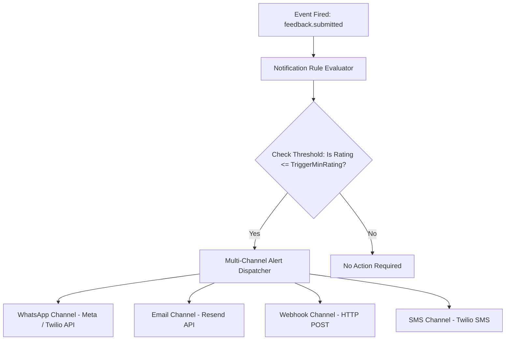

# 12. Multi-Channel Notification Engine: Qrezo v2

## 1. Notification Architecture & Channel Dispatcher

The **Notification Engine** dispatches real-time alerts when specific feedback thresholds or system triggers are breached.



---

## 2. Supported Notification Channels Matrix

| Channel | Provider | Target Latency | Use Case | Failover Fallback |
| :--- | :--- | :--- | :--- | :--- |
| **WhatsApp** | Meta WhatsApp Cloud API / Twilio | **< 3 seconds** | Urgent negative feedback alerts to floor manager. | Email Channel |
| **Email** | Resend API | **< 5 seconds** | Daily feedback summaries, manager escalation, invites. | None |
| **Webhook** | HTTP POST Endpoint | **< 2 seconds** | Integration with POS, Slack, CRM (HubSpot/Zapier). | Retry 3x exponential backoff |
| **SMS** | Twilio SMS API | **< 5 seconds** | Alternative urgent notification when WhatsApp fails. | Email Channel |

---

## 3. WhatsApp Alert Message Payload Specification

When a 1-star to 3-star rating is submitted at a table, the WhatsApp channel dispatches a template message formatted for immediate readability on mobile screens:

```text
⚠️ NEGATIVE FEEDBACK ALERT - Bistro Downtown

📍 Location: Table 14 (Patio Zone)
⭐ Rating: 2 / 5 Stars
🏷️ Category: Slow Service
💬 Comment: "Waited 30 minutes for appetizers. Water was never refilled."
👤 Customer: John Doe (+14155552671)

🕒 Time: 07:42 PM
🔗 Acknowledge Incident: https://qrezo.com/dashboard/incidents/inc_998123
```

---

## 4. Notification Rule Schema & Configuration (`models/NotificationRule.ts`)

```typescript
import mongoose, { Schema, Document } from "mongoose";

export interface INotificationRule extends Document {
    workspaceId: mongoose.Types.ObjectId;
    ruleName: string;
    channel: "whatsapp" | "email" | "webhook" | "sms";
    triggerCondition: {
        minRating?: number; // e.g. 1
        maxRating?: number; // e.g. 3
        categories?: string[];
    };
    recipientConfig: {
        phoneNumbers?: string[]; // E.164 format
        emailAddresses?: string[];
        webhookUrl?: string;
        webhookSecret?: string;
    };
    isActive: boolean;
    createdAt: Date;
}

const NotificationRuleSchema = new Schema<INotificationRule>(
    {
        workspaceId: { type: Schema.Types.ObjectId, ref: "Workspace", required: true, index: true },
        ruleName: { type: String, required: true },
        channel: { type: String, enum: ["whatsapp", "email", "webhook", "sms"], required: true },
        triggerCondition: {
            minRating: { type: Number, default: 1 },
            maxRating: { type: Number, default: 3 },
            categories: [{ type: String }],
        },
        recipientConfig: {
            phoneNumbers: [{ type: String }],
            emailAddresses: [{ type: String }],
            webhookUrl: { type: String },
            webhookSecret: { type: String },
        },
        isActive: { type: Boolean, default: true },
    },
    { timestamps: true }
);

export default mongoose.models.NotificationRule || mongoose.model<INotificationRule>("NotificationRule", NotificationRuleSchema);
```

---

## 5. Webhook Signature Verification Standard

All outgoing Webhook notifications include a `X-Qrezo-Signature` header calculated using HMAC SHA-256 to allow recipient servers to verify payload authenticity:

```typescript
import crypto from "crypto";

export function generateWebhookSignature(payload: string, secret: string): string {
    return crypto
        .createHmac("sha256", secret)
        .update(payload)
        .digest("hex");
}
```
