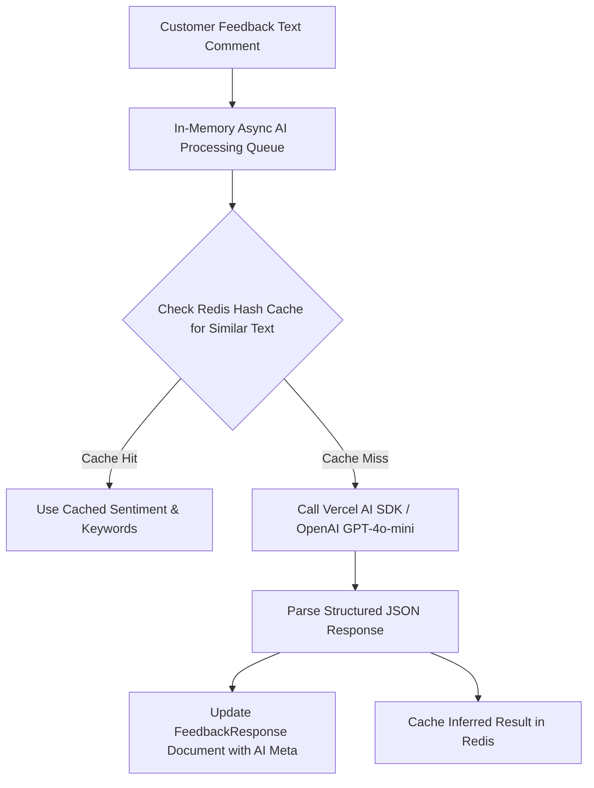

# 13. AI Architecture & Customer Intelligence: Qrezo v2

## 1. Pragmatic AI Strategy & Goals

Qrezo v2 incorporates Artificial Intelligence strictly where it delivers high-value operational efficiency for business owners. We avoid unnecessary AI hype and focus on four concrete capabilities:

1. **Automated Feedback Sentiment Scoring:** Real-time sentiment tagging (Positive, Neutral, Negative, Urgent Escalation) of unstructured customer comment text.
2. **Weekly Review Summarization:** Condensing 500+ customer comments into 3 actionable bullet points for general managers.
3. **Smart Response Generator:** Drafting professional, personalized response text for managers responding to negative reviews.
4. **Keyword & Topic Extraction:** Automatically identifying recurring operational bottlenecks (e.g., "slow service", "dirty washroom", "cold soup").

---

## 2. AI Intelligence Pipeline Architecture



---

## 3. Structured LLM Prompt & Output Specification

To ensure 100% reliable programmatic parsing, all LLM completions use **Structured JSON Outputs** via Zod schemas.

### Zod Schema Definition
```typescript
import { z } from "zod";

export const AISentimentAnalysisSchema = z.object({
    sentiment: z.enum(["very_positive", "positive", "neutral", "negative", "urgent_crisis"]),
    sentimentScore: z.number().min(-1.0).max(1.0),
    primaryCategory: z.enum(["food_quality", "service_speed", "staff_behavior", "cleanliness", "pricing", "ambience"]),
    keyKeywords: z.array(z.string()).max(5),
    urgencyFlag: z.boolean(),
    suggestedManagerResponse: z.string().max(500),
});

export type AISentimentAnalysisResult = z.infer<typeof AISentimentAnalysisSchema>;
```

### System Prompt Specification
```text
You are an expert AI Operations Analyst for restaurant and hospitality businesses.
Analyze the following customer feedback comment and extract structured insights.

Rules:
1. Classify sentiment score from -1.0 (extremely negative) to +1.0 (extremely positive).
2. Set urgencyFlag to TRUE if customer mentions food poisoning, physical injury, racial discrimination, or legal threats.
3. Draft a empathetic, professional 2-sentence manager response apologizing and offering to resolve the issue.

Customer Comment: "{commentText}"
```

---

## 4. AI Cost Optimization & Rate Protection

To prevent runaway LLM token costs, Qrezo v2 implements three cost optimization safeguards:

| Safeguard | Mechanism | Impact / Savings |
| :--- | :--- | :--- |
| **Model Selection** | Use `gpt-4o-mini` or `Claude 3.5 Haiku` for sentiment tagging; reserve full GPT-4o for weekly summaries. | **~90% reduction** in LLM cost per feedback comment. |
| **Minimum Text Length**| Skip LLM processing for feedback shorter than 4 words (e.g., "Good", "Bad", "OK"). Use simple rule fallback. | Eliminates ~35% of unnecessary API calls. |
| **Redis Result Caching**| Cache exact string hashes of repetitive comments ("great food thanks") for 30 days. | Eliminates ~20% of redundant LLM completions. |
