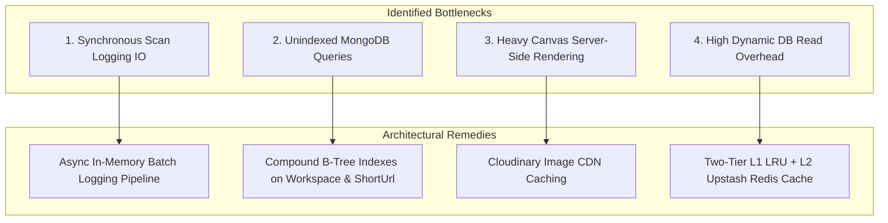

# 16. Scalability & Performance Engineering: Qrezo v2

## 1. Scale Targets & Throughput Horizons

Qrezo v2 is architected to scale seamlessly from early startup volume to high-density enterprise throughput:

```
┌────────────────────────────────────────────────────────────────────────┐
│                      Capacity Planning Horizons                        │
├───────────────────────┬───────────────────────┬────────────────────────┤
│ Metric                │ Horizon 1 (Current)   │ Horizon 2 (Target)     │
├───────────────────────┼───────────────────────┼────────────────────────┤
│ **Monthly Scan Vol**  │ 500,000 Scans / mo    │ 50,000,000 Scans / mo  │
│ **Peak Scan RPS**     │ 50 Requests / sec     │ 5,000 Requests / sec   │
│ **SmartPage LCP**     │ < 600ms               │ < 300ms                │
│ **Redirect Latency**  │ P95 < 35ms            │ P95 < 15ms             │
│ **Active Workspaces** │ 250 Workspaces        │ 25,000 Workspaces      │
└───────────────────────┴───────────────────────┴────────────────────────┘
```

---

## 2. System Bottlenecks & Architectural Remedies



---

## 3. Database Scaling & Sharding Topology

1. **Read Replicas:** Database reads (analytics reports, dashboard feeds) are directed to MongoDB Atlas Secondary Read Replicas (`readPreference=secondaryPreferred`).
2. **Horizontal Sharding Key:** When the `ScanLog` collection exceeds **100 Million Documents**, sharding is enabled using the compound shard key `{ workspaceId: 1, scannedAt: -1 }`. This guarantees that scan data for a single workspace resides on the same physical shard node, eliminating cross-shard scatter-gather queries.

---

## 4. Edge Caching & Content Delivery Network (CDN) Strategy

- **Static SmartPage Assets:** JS bundles, CSS stylesheets, and icons are cached infinitely (`Cache-Control: public, max-age=31536000, immutable`) on Cloudflare / Vercel Edge Network.
- **Dynamic Micro-Page HTML:** Rendered at Edge using Incremental Static Regeneration (ISR) with a `revalidate: 60` seconds header, ensuring micro-pages load instantly from edge POPs near the physical scanner.
