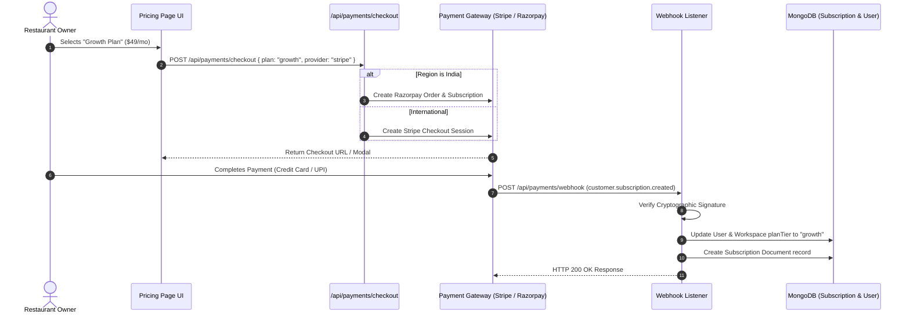

# 17. Monetization & Pricing Architecture: Qrezo v2

## 1. Value-Based Pricing Strategy & Packaging

Qrezo v2 transitions from static feature-gating to a **Hybrid Value-Based Pricing Model**. Pricing scales directly with the number of physical business locations (Workspaces), active SmartPages, scan volume, and automation capabilities.

```
┌────────────────────────────────────────────────────────────────────────┐
│                        Qrezo v2 Tier Matrix                            │
├───────────────────┬───────────────────┬───────────────────┬────────────┤
│ Free Tier         │ Starter Tier      │ Growth Tier       │ Enterprise │
│ $0 / mo           │ $19 / mo          │ $49 / mo          │ $199 / mo  │
├───────────────────┼───────────────────┼───────────────────┼────────────┤
│ • 1 Workspace     │ • 1 Workspace     │ • 3 Workspaces    │ • Unlimited│
│ • 3 Dynamic QRs   │ • 25 Dynamic QRs  │ • 100 Dynamic QRs │ • Unlimited│
│ • 1 SmartPage     │ • 3 SmartPages    │ • 15 SmartPages   │ • Unlimited│
│ • 1,000 Scans/mo  │ • 25,000 Scans/mo │ • 100,000 Scans/mo│ • Unlimited│
│ • Basic Analytics │ • Email Alerts    │ • WhatsApp Alerts │ • Custom   │
│                   │                   │ • AI Summaries    │   Webhooks │
└───────────────────┴───────────────────┴───────────────────┴────────────┘
```

---

## 2. Comprehensive Pricing Tier Breakdown

| Feature / Quota Dimension | Free Tier ($0) | Starter ($19/mo) | Growth ($49/mo) | Enterprise ($199/mo) |
| :--- | :--- | :--- | :--- | :--- |
| **Active Dynamic QR Codes** | 3 | 25 | 100 | Unlimited |
| **SmartPages** | 1 | 3 | 15 | Unlimited |
| **Monthly Scan Quota** | 1,000 | 25,000 | 100,000 | 1,000,000+ |
| **Workspaces / Locations** | 1 | 1 | 3 | 15 Included ($10/extra) |
| **Team Members per Workspace** | 1 (Owner) | 3 Members | 10 Members | Unlimited |
| **Conditional Feedback Routing**| ❌ No | ✅ Yes | ✅ Yes | ✅ Yes |
| **WhatsApp Manager Alerts** | ❌ No | ❌ No | ✅ Yes (1,000 msgs) | ✅ Yes (10,000 msgs) |
| **AI Sentiment & Summaries** | ❌ No | ❌ No | ✅ Yes | ✅ Yes |
| **Custom Domain Support** | ❌ No | ❌ No | ✅ Yes (`feedback.brand.com`)| ✅ Yes |
| **API & SDK Access** | ❌ No | ❌ No | ❌ No | ✅ Yes |

---

## 3. Dual Gateway Subscription Lifecycle Strategy



---

## 4. Automated Subscription Enforcement & Overage Rules

1. **Scan Limit Breach:** When a workspace reaches **100% of its monthly scan quota**, dynamic QR codes do NOT break or throw `404` errors (preventing bad customer experiences). Instead, the system serves the page normally while triggering an automated email warning to the owner: *"Your QR scans exceeded your plan quota. Upgrade to Growth to retain detailed analytics."*
2. **Soft vs. Hard Limits:** Hard limits apply to Workspace creation and Team Member invites; soft limits apply to monthly scan analytics logging.
