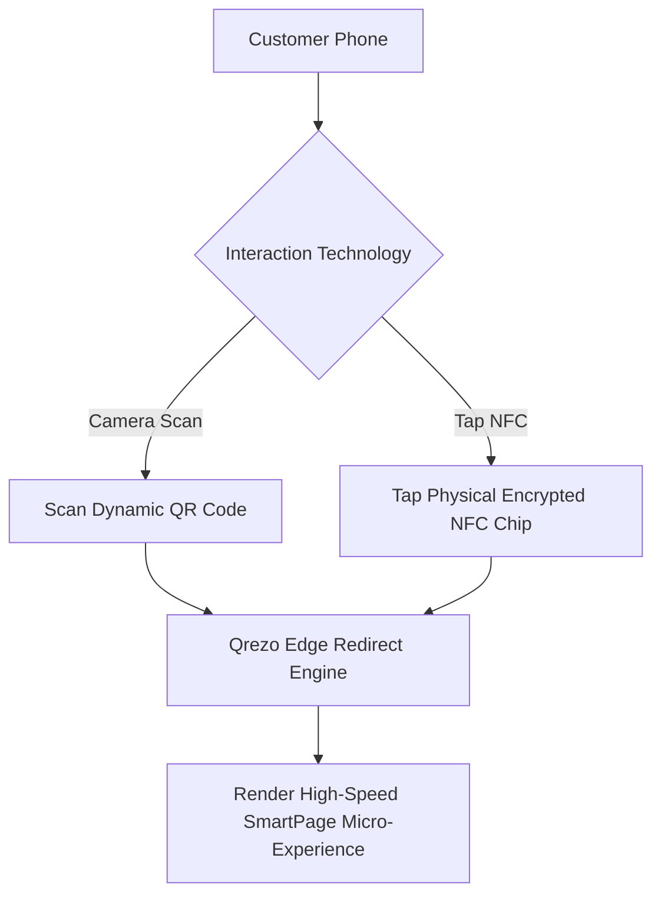

# 20. Future Product Expansion & Innovations: Qrezo v3+

## 1. Physical World IoT & Infrastructure Innovations

Beyond the core software features of Qrezo v2, the platform is architected to evolve into physical hardware and advanced proximity interaction technologies over a 3-5 year horizon.

```
┌────────────────────────────────────────────────────────────────────────┐
│                        Qrezo Future Horizons                           │
├────────────────────────────────────────────────────────────────────────┤
│ Horizon 1 (v2.0): Smart QR & Mobile Micro-Experiences (Current Blueprint)│
│ Horizon 2 (v2.5): Hybrid Dynamic NFC + QR Physical Hardware Integration │
│ Horizon 3 (v3.0): Native WhatsApp Commerce & Conversational AI Workflows│
│ Horizon 4 (v4.0): Spatial Geofencing & Autonomous Offline Mesh Sync    │
└────────────────────────────────────────────────────────────────────────┘
```

---

## 2. Hybrid Dynamic NFC + QR Hardware Provisioning



### Hybrid Hardware Specifications
- Physical standees produced by Qrezo will feature an **NTAG213 Encrypted NFC Chip** embedded underneath the printed QR code.
- Enables frictionless single-tap customer entry without requiring camera positioning in low-light dining environments.

---

## 3. Native WhatsApp Conversational Commerce

Future iterations will allow customers to complete transactions directly inside WhatsApp without leaving the messaging app:

1. **Table Menu Ordering:** Scan QR $\rightarrow$ Open WhatsApp $\rightarrow$ Select food items via native WhatsApp Catalog $\rightarrow$ Pay via WhatsApp Pay / UPI.
2. **Instant Table Reservation:** Tap NFC $\rightarrow$ WhatsApp bot prompts for party size & time $\rightarrow$ Booking confirmed in restaurant POS.

---

## 4. Vertical Innovation Blueprints

| Industry Vertical | Innovation Feature | Operational Benefit |
| :--- | :--- | :--- |
| **Healthcare & Clinics** | Smart Patient Check-in & Intake Form | Patients scan QR in waiting room to fill medical history directly into EMR. |
| **Real Estate & Construction**| Geofenced 3D Property Tour | Scanning yard sign QR unlocks interactive 3D virtual tour only when physically standing near property. |
| **Gyms & Fitness** | Equipment Repair Trigger Block | Gym member scans QR on broken treadmill to immediately alert maintenance team via Slack. |
| **Automobile Dealerships** | Instant Test Drive Booking | Showroom visitors scan vehicle window QR to schedule test drive with assigned salesperson. |

---

## 5. Summary Conclusion

With **Qrezo v2**, Qrezo transcends the utility market of static QR code generators. By combining lightning-fast edge redirects, a modular block landing page engine, intelligent closed-loop feedback routing, multi-tenant workspace governance, and multi-channel alerting, Qrezo becomes the definitive **Smart QR Business Platform** for modern physical enterprises.
